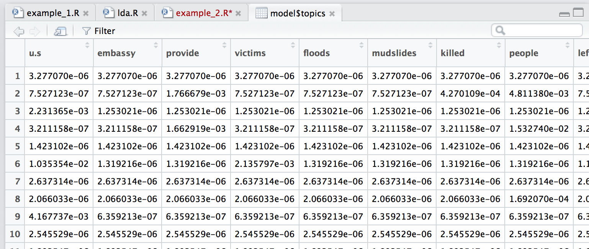
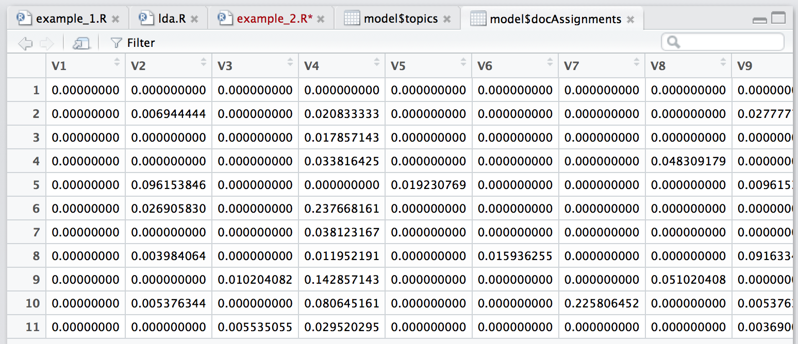

# Understanding Topic Modeling
### with Neal Audenaert
<!-- neal.audenaerte@gmail.edu -->

# June 12 2017

Relieved to hear that Neal also comes to topic modelling from a fairly skeptical perspective -- but lately people are using it in pretty sophisticated, less black-box-y ways

Sometimes the thing that's easier IS to pull the spreadsheet open in excel, instead of taking six weeks to write a program

Another mention of DocuScope - I should try it

(Seems the buckets-with-training-texts approach is really unusual here)

Topic modeling removes one source of human bias -- ensures even attention to various kinds of features, etc -- but introduces new sources in set-up and analysis

Biggest challenge is analysis of results

The key to collaborating is to know enough, but not to try to know everything -- the best work requires more expertise than one person can have

## Topic Modelling! What it is!

Given a set of documents; we assume that there is some internal organization (topics) that we want to model computationally

What is a model? A representation and simplification, for a purpose

The set of documents is organized, understood to some level, and we have questions about them; we want to build a model that is meaningful (we can actually interpret it), useful, and approximate (not pure objective truth; can't answer really precise, fine-grained questions)

(Problem with sentiment analysis -- not usually actually meaningful! **Brand identity managers** care a lot, but for humanities research it's rarely what we want. Pleased to see confirmation that this isn't a useful direction to steer our collaboration unless we're using sentiment as a classifying tool for something else, rather than directly asking about sentiment)

Main source: Latent dirichlet allocation, DM Blei - 2003
Big idea: Documents exhibit multiple topics!

If I'm talking about topic X, I'm likes to use words Y and Z at various probabilities

Got a bunch of topics in the world, and pretend we know what they are in advance. There are fifty topics in the world!

Then we have a document, which exhibits multiple topics in different proportions

The words in the document are each tied to a specific topic... the model can't handle the idea that a word might reference multiple topics

In practice one of the topics is often going to be junk; conveniently the weird random stuff mostly clustered together -- words that appear with uniform distribution throughout the corpus and therefore don't mean anything about the statistical model

But when we start out, we want to learn all the topics, and the topic proportions and assignments, but all we have are the documents.

The heavy lifting and machine learning lies in methods to learn topics etc
The inference process is approximate
Mind-boggling that we can take documents and get back all the rest of the information; more mind-boggling that it mostly works

Inference is approximate and randomized so you get a different answer every time
(Not an algorithm, but a heuristic, because it doesn't give the same answer every time)

Topic modeling is a family of statistical techniques for analysing corpora that reperesentes the structure of relationships within and between documents; provides methods for automatically organizing, understanding, searching and summarizing

LDA is the first and most widely used technique; unsupervised clustering of words into topics; foundation for more complex models

(Alternative would be a supervised learning model where you say "here are my categories, please sort things into categories" -- i.e., the things I am accustomed to.)

### How Do?
* First thing we are going to do: make a bunch of assumptions about the world!
In a fairly rigorous manner, that we can codify statistically

* Then we will organize and collect the data that we will use in the model: gathering all the text files, but also often processing them to simplify/transform files -- e.g., stemming

* Those both allow us to infer the posterior: this is effectively the process of running Mallet; the statistical model in the middle that chugs through the data and then gives an output at the end

* We check & verify that it's good

* We can use it to make predictions (though people only rarely do this) -- I think this is what *I* am interested in doing, using it to see if we can predict whether a work is by a man or a woman. **Are any topics predictive of authorial gender?**

* What we really want to do is explore and understand those topics, and hopefully search for new and meaningful relationships in our dataset

## Things that have been done with topic modelling

Word clouds (weighted by probability) more telling than just lists of each topic's words -- Some topics might have one or two words that dominate the topic, probability-wise, and others have more even distribution: when we talk about brand, we talk about BRAND, but when we talk about justice we talk about a lot of related concepts also

InPhodata topic modelling tool with a useful (though dense) interface: inphodata.cogs.indiana.edu

Andrew Goldstone and Ted Underwood (2012): What can topic models of PMLA teach us about the history of literary scholarship?
Network of interrelated topics, and sparklines of interest in each topic over time

Carson Aievert, Kenneth E Shirley (2014) LDAVis: A Method for Visualizing and Interpreting Documents
http://cpsievert.github.io/LDAVis/reviews/vis/#topic=3&lambda=0.6&term=
Rather than just looking at how strongly associated a word is with a topic, you also have to weight that by how frequently the word appears overall in the corpus -- find the most distinctive/relevant words for each topic
If I'm talking about evolutionary biology, how likely overall is it that I will use the word "biology"? Versus, what words am I only likely to use if I'm talking about evolutionary biology? How salient is the word to the topic?

What's powering all of these different displays is the same data that came out of the same inference data, but doing different things with the final exploration set

### Q & A

**How many documents is suitable?** ... Once you clear a certain threshold, more texts will allow more fine-grained examination of more topics. (If you do a lot of topics on a more homogenous corpus, the topics are likely to be finer-grained, e.g. archive of PMLA vs archive of just a Victorian studies journal) Determined experimentally! Via guess and check.

Some ways to determine how many topics you can get, some rules of thumb... 100 or more documents at least, of paragraph-to-article length, relatively similar in length. Too short: too little data. Longer than an article: too many different things being talked about for the words that cohere together to find enough signal.

## Lunch conversations

Hung out with Caroline and a friend of hers - mostly talked about the job market, etc, but also touched upon The Field

Something interesting about the forgotten peers of now-famous works (e.g., Ozymandias and Ozymandias) - can I spot the "adjacent possible" which enables a set of similar works? can I draw out why one work ends up being selected for canonization? (e.g. Sherlock Holmes)

## Getting Set Up

Need to have R and RStudio

Create a new project > Version control > Check out a project > Git > paste repository URL

In TopicModelingRTools, run these two commands to make sure all the necessary bits are installed and running properly:
```source("functions/lda.R")
source("functions/import.R")
```

To fix problems with Java, go here: http://charlotte-ngs.github.io/2016/01/MacOsXrJavaProblem.html

in R, run this, making sure to have the right version number in the URL:
`dyn.load('/Library/Java/JavaVirtualMachines/jdk1.8.0_**131**.jdk/Contents/Home/jre/lib/server/libjvm.dylib')`

the code being used is adapted from Matt Jockers' book -- http://www.matthewjockers.net/books/

Trying to understand how I will be able to do my own topic modelling going forward... do I need to write a .R program that will call mallet and run my LDA? will I be able to, in this R program, easily use structured learning instead?

**LL/token** number tells you how good your model is -- closer to zero is better. e.g., 9.4 with 50 topics and 8.2 with 100 topics: 100-topic model is probably better than 50-topic model. But use with caution! Better metric is actually looking at yout output. If you're getting to 500 runs and you're not seeing improvement in LL/token, no need to run 1000 times -- can stop sooner.

LL is the model's log-likelihood divided by the total number of tokens, this is a measure of how likely the data are given the model. Increasing values mean the model is improving. ([Statistics lesson on likelihood and log-likelihood](https://onlinecourses.science.psu.edu/stat504/node/27))

Got example_1.R running! Got 50 word clouds of topics! They're so pretty! Based on AP news articles -- remarkably coherent topics produced

```> topic.23 <- model$getTopic(23)```
get set up to look deeply at a particular topic

```> topic.23$getWords(10)```
gets the top 10 words predictive of that topic

```> topic.23$getDocs(10)```
gets the documents with the highest proportions of that topic

```> top.docs <- topic.23$getDocs(10)```
make a list of top 10 documents for a topic

```> model$getDocument(names(top.docs[4]))```
gets 4th article in top 10 article list, displays the document itself

## Wrap-up

We've said hello to each other and to R and to topic modelling! Tomorrow we will do a deep dive into 


# June 13 2017

## The statistical model underlying topic modeling!

### Bayesian statistics review

<!-- I can tell that he really understands what he is talking about, but I am not sure he is explaining it very helpfully... so much of "we all know" and "that makes perfect sense" -->

A function takes in input and returns output; we're going to be working with multi-dimensional vectors with a dimension for every word, so the function will take in thousands of inputs

Easiest probability (function?) is just flipping a coin (a binomial): p(a) -> {H:0.5, T:0.5}

Derivative of a function = area under the curve ```f(x) = ∫f(x)dx```

In computer science, an integral turns into just addition ```Σf'(x)dx```

If it's discrete, everything will add up to one -- the probability that SOMETHING will happen is 100%

Multinomial: a probability distribution function with a lot of different inputs

A document is a series of random draws from a probability distribution function (pool of words) -- with this document, what's the probability that a series of random draws would result in this series of words?

Assuming all words are equally likely, the probability of any one word is ~1/65,000 -- probability of Moby Dick is (1/65k)^200,000 ... seems unlikely that it was random.

But we can also look at the probability of A **and* B occurring together -- ```p(a,b)``` -- what's the probability that it's 95 degrees and June?

```p(a,b) = 1/12 * .01``` as baseline (1/12 months are June, 1% of days in the year are 95 degrees) -- but of course these things influence each other; these variables influence each other

```p(a|b)``` - probability of A **given** B -- called a joint conditional

```p(a,b) = p(a) * p(b|a)``` -- multiplication rule

```p(a,b) = p(b) * p(a|b)```

```p(b|a) * p(a) = p(a|b) * p(b)```

Let's say we're trying to detect cancer! What is the probability that Patient A has cancer, given that some test for cancer is positive? ```p(Cp|T+)```

```p(T+|Cp) * p(Cp) = p(Cp|T+) * p(T+)```

```p(T+|Cp) * p(Cp) / p(T+) = p(Cp|T+)``` -- probability of cancer given positive test will be probability that test is positive when cancer is present times prior likelihood of cancer, divided by prior likelihood of positive test

Positive test means ```p(T+) = 1```

Test is 80% sensitive so ```p(T+|Cp) = .8```

let's say that 1% of people have cancer so ```p(Cp)```

the false positive rate of the test is .008 ```p(Cp|T+)```

A naive Bayesian probability; conditional probabilities are the fundamental structure of Bayesian statistics

### Time for cartoon models of LDA: The parable of the factory 

Document factory produces some well-defined set of documents (19th
C. novels, Victorian poetry, AP articles, letters of Margaret Sanger)

The process of creating these documents is a trade secret of the
factory that we’d like to reverse engineer to figure out what’s going on

The only evidence we have is the documents that the factory produces
and our theory about what is happening inside

The process of representing our knowledge of what's going on is called supervised learning, and that's a lot of work -- so we're going to use unsupervised learning to make a series of models that are progressively more complex

Maybe inside the factory is a giant bucket of words! And a factory worker goes and scoops some out and dumps them in the document. -- Really easy to figure out what is in the original bucket of words (it's all the words in all the documents and their relative prevalence), but not the most useful model. This makes a word cloud of a whole book, baiscally -- can check basic word frequency, compare ads for girls vs ads for boys for example and see that they use different words

Next most sophisticated model says that there are several different buckets of words to pull from: factory worker first picks a bucket (maybe the whale bucket) and pulls words randomly and that bucket produces Moby Dick, whereas the finches bucket would produce Origin of Species -- more accurate but also more complex; we have to be able to infer how many different buckets there are to calculate the probability of a given document being produced, and we have to guess which bucket the worker went to

Final complication: buckets of buckets! Factory worker scoops 15000 words from bucket 1, scoops 3000 words from bucket 2, 600 words from bucket 3, etc, and then assembles all those words into a document -- now we have to guess which buckets the factory worker picked from, in what proportion he picked from those buckets, and what the contents were of those buckets

Some topics are more popular than others -- those buckets are bigger. (It seems important to me to remember that not all topics are created equal, that it's not actually a flaw in the analysis if some topics predominate or are more/less complex)

**(I feel like the pattern I need to train myself to look for is not "contrast of two things" but "the long tail")**

The buckets totally ignore what order words go in -- built into the model is the assumption that word order doesn't matter. To integrate word order again, try all ngrams (eg 2grams Myname nameis isIshmael) but this MASSIVELY increases necessary of processing

Our model assumes that certains structures are hidden, latent variables that we cannot see and have to infer

The Parable Explained
* Hidden vs. observed structure
* Buckets are probability distributions over a vocabulary
* Documents are multinomials
* Choice of a bucket yields a conditional probability -- ```p(d|b6)``` - what's the probability that I got this bucket given that I went to bucket 6?
* Selection of multiple buckets yields a mixture model  -- this is Blei's insight that documents talk about multiple topics

### Formalizing our statistical model

[The powerpoint is extremely useful.](https://github.com/lawrenceevalyn/THE-DISS/blob/master/dhsi-2017/LDA-equation-explanation.pdf)

Two ways to do statistics: evidentialist vs Bayesian. Evidentalist: descriptive, counting all the things that happen. Bayesian: trying to encode belief and uncertainty. Today we're doing Bayesian, but for the most part it doesn't matter

We are inferring and then encoding our beliefs about documents and how they are constructed

David Blei's explanation is actually very readable and useful (my theory: this is part of why he gets cited so much)

Intuition (as we approach topic modelling)
* There are topics
* Words are used differently (i.e., with different frequency) in different topics
* Documents can be about multiple topics

Assumptions (underlying our specific mathematical approach)
* Documents are bags of words -- it is possible to use stemming etc to merge individual words but this usually makes things more confusing
* Topics are fixed and finite -- this is a terrible model of the world!!
* Topics are independent -- also obviously wrong
* Documents are independent -- also obviously wrong!

The generative statistical model behind LDA: the RESULT that topic modelling will produce

The LDA model is expressed as a probability function p. This is the joint probability (or likelihood) of a given set of topics (**β**), a set of per-document topic distributions (**θ**), and the specific association of a topic (**z**) for each word in each document (**w**)

p(β,θ,)

From the outset we willl assume that tere is a universe of K topics, β. We will refer to each individual topic by index *k* as in βk

A topic is formally defined as a probability distribution over a vocabulary *V* (a list of all the words in all the documents) -- words in the vocabulary are terms, words in the document are tokens

Topics are our name for probability distribution functions over a vocabulary -- we can we can and should argue over what a "topic" really is in our model

“We refer to the latent multinomial variables in the LDA model as
topics, so as to exploit text-oriented intuitions, but we make no
epistemological claims regarding these latent variables beyond their
utility in representing probability distributions on sets of words.” – Blei, 2003

We need a way to compute likelihood of any given topic p(βk). To do that we assume that βk is drawn from a Dirichlet. A Dirichlet is a probability distribution function that generates **random** probability distributions. η is a parameter that governs the dispersion of the Dirichlet.

With this universe of topics,we can start generating documents!

For each document d, first, I pick some topics (θd) based on another Dirichlet allocation based on *a*

For each word in that document, choose a topic from θd, then choose a word from that topic's word distribution

(The big boxy diagram that we are working our way through is called plate notation)

The token that appears in a document is, in that moment, representing only one topic; each word in the vocabulary technically pertains to all topics but will only be high-frequency for a very few of them

One reason for variation when running multiple analyses: it changes its mind about what topic to assign a token to?

βk and θd are (essentially?) matrices.

βk: Our topic matrix! Each row is a topic, each column is a word from our vocabulary:


θd: Our document matrix! Each row is a document, each column is a topic:


How topics pick what words they have: **Expectation maximization:** Say we look at a distribution of datapoints, and we can see three Gaussian functions (clusters of datasets with mean x and y and standard deviation) -- tell the model that there are three topics, and it will randomly pick three starting points. Label the datapoints based on which of those three random points they're closest to. Move the three random points to the center of the datapoints in their "zone". Now forget the zones, and draw new zones based on the new three less-random-now points. Repeat, and the three points will work their way to the center of the three clusters! (basically a generalization of Nearest Neighbour to fit a probability distribution)

**Is there a way to determine in advance how many topics to look for??????**

I do feel a lot better about the process of iterating "as many times as seems sensible" -- the goal is to iterate *enough* that things can converge, and past that nothing really interesting is going to happen.

Number-to-topic assignment is arbitrary but unless something is very wrong there will always be, e.g., an "art and wine" topic from AP news articles

It's a good thing that results are slightly different between runs -- we're making statistical inferences here, it's valuable to know what things re-occur

Topic models provide a rough sense of things, a feel -- they give a lot of numbers, but these numbers are not actually anywhere near as precise as they feel. (Trying to be vaguely right rather than precisely wrong -- Tufte used that quote too) -- you can't make fine-grained arguments about, e.g., one word being more prominent in a topic than another;

### What Do?

**Topics:** what words are in the topic? what's the shape of the distribution? what documents are most associated with this topic (i.e., very narrowly focused documents that are only about that one topic)? What other topic is most similar to this topic, based on word overlap?

**Documents:** what topics are in it? what's the distribution of those topics?

**Corpus:** what topics show up most often? what topics are most similar to other topics (based on overlap of words)? what topics tend to appear together in documents?

If we have metadata, like publication date, can look for temporal relationships. Can collapse matrices to group documents based on journal publishing, author, author gender, etc. Can also collapse topics to say "these are the same topic"

(easiest way to do it is to have a spreadsheet with document filenames plus all the metadata, sort by filenames, copy-paste into spreadsheet of R results)

(go to the D3 class to learn how to visualize all this stuff!)

## Topic Modeling Projects

**Mining the Dispatch** - http://dsl.richmond.edu/dispatch/
* Almost like a finding aid - spotting which articles are fugitive slave ads, etc. Inviting analysis more than doing analysis?
* The "humour" topic predictive words don't look like "humour" off the bat -- they look random -- but the exemplary articles are definitely all jokes. Can't just look at predictive words to determine topic -- have to took at exemplary articles too. (He put a lot of work into interpreting the topics)
* the "so what" argument is that, e.g., patriotic poetry and vitriolic anti-North diatribes, despite using very different rhetoric, are in fact two kinds of the same coin / serving the same social function because they follow the same temporal patterns, co-occurring and spiking with key milestones in the war -- a literary/historical/interpretive argument bolstered by specific topic data

**Martha Ballard's Diary** - http://www.cameronblevins.org/posts/topic-modeling-martha-ballards-diary/
* It's nice to have models confirm things you already know... turns out you talk more about cold weather in the winter!
* this is a side project by a PhD student
* impressive how clear, cohesive, and useful the topics are based on just one book with entries that are barely a few sentences long -- I guess it helps that there are nearly 10,000 entries?
* well-suited to the method because it's so temporal -- it would be interesting to put several diaries together!
    * interesting to do book reviews of the 18thC...?
    * could I topic-model book titles????

**Topic Models of PMLA** - http://agoldst.github.io/dfr-browser/demo/ https://tedunderwood.com/2012/12/14/what-can-topic-models-of-pmla-teach-us-about-the-history-of-literary-scholarship/
* created in response to / to test a very specific expected narrative/story about what the history of the field has been; need to have that kind of framework in mind in order to know what the topic model is telling you

Topic modelling defamiliarizes the text and forces you to look at it again, as a virtue / use of the method.

**Signs@40** - http://signsat40.signsjournal.org/
* when models fail, you'll either get topics that join or topics that split -- so maybe sexual harrassment & zines are in the same topic because that's the wrong name for the thing that connects them, or maybe they needed more topics; one way to test would be to re-run the model a few times and see whether they always go together or sometimes lump with other things
* built with a tool that Goldstone has made open-source -- **I should DEFINITELY use this framework if I can**
* "Africa" topic has a big spike when they did a special issue - http://signsat40.signsjournal.org/topic-model/#/topic/46/1992 - but then that spike lingers, with more engagement the next year, and then trailing off over the next few years -- suggests that 

**Networked Corpus** - http://www.networkedcorpus.com/
* 18thC texts so I should go try to find out more -- but the online project is mostly moved to legit publications now

**Topic Modeling Modernism** - http://jgoodwin.net/mm-browser/
* a little alarming that everybody's work suddenly looks like Goldstone's

**Words Alone: Dismantling Topic Models in the Humanities** - http://journalofdigitalhumanities.org/2-1/words-alone-by-benjamin-m-schmidt/
* topic modeling astonishingly good at ship logs finding routes, actually
* "To disentangle different sorts of shipping patterns, the simplest clustering algorithm of all, k-means, does an excellent job pulling apart different sorts of voyages" -- **make more topics than you need, then use k-means to cluster/reduce?**

**Topic Modeling and Figurative Language** - http://journalofdigitalhumanities.org/2-1/topic-modeling-and-figurative-language-by-lisa-m-rhody/
* “death, life, heart, dead, long, world” is not a topic; "African-American elegies" is a topic, which is manifested by the statistical correlation of those words

Themes in 19th-Century Lit - http://digitalcommons.unl.edu/cgi/viewcontent.cgi?article=1105&context=englishfacpubs

Some Assembly Required - http://www.lisarhody.com/some-assembly-required/  http://www.lisarhody.com/the-story-of-stopwords

## Visualization Tools

**InPhO Topic Explorer** - http://inphodata.cogs.indiana.edu:16040/?doc=knowledge-analysis
* useful because it's SO interactive -- it's hard to get a sense of anything as a static list
* available open-source so I can use it too! https://github.com/inpho/topic-explorer/

**DFR Topic Browser** - http://agoldst.github.io/dfr-browser/
* this is the Goldstein one we've seen everywhere

**LDAViz** - https://github.com/cpsievert/LDAvis
* relevance(term w | topic t) = λ * p(w | t) + (1 - λ) * p(w | t)/p(w)
* also usefully VERY interactive -- sliding the relevance metric really helps clarify what the topic actually is, since both unique words and disproportionate words are relevant to inferring underlying topic
* chart of PC1/PC2 uses principal component analysis to convert multidimensional terms/documents matrix ... looks at highly-dimensional data, which is nonetheless mostly structured along an axis/partiular space; PCA figures out the best axis along which to flattet display to show as much information as possible. (classic example is drawing a banana: one cross-section could be a circle, another a column, but we always draw it from the angle that shows its curve) --  condense thousands of axes to two, and then plot those two principal components, which preserves as much information about relative distance as possible

jsLDA - http://mimno.infosci.cornell.edu/jsLDA/

## Wrap-up

OMG OMG OMG, topic-model titles of ESTC and then use those topics on the ECCO-TCP documents!!!!!!!!!!!!!!!!!!!!!!!!!

A way to look at two groups within a corpus on the same metric?
* one way to analyze: throw it all in one bucket and analyze at once, see, e.g., these topics show up more in group 1 and those more in group 2
* another way: to run two separate topic models, and to interpret the non-corresponce between them

# June 15, 2017

### Getting used to plate notation

Thing is a circle is a parameter; when one paramater depends/is conditioned on another / when we calculate probability of one given the other, arrow between then goes from condition to original parameter

If there are a lot of related parameters, rather than drawing a whole bunch of circles we put a box around it with its own label for the number of times that the parameter appears

### Reflecting on the model

Could build into the model the idea that the words used for a given topic change over time... could also build into it the relative use of topic over time? (existing work does that analysis after the LDA model, but can get extra information by building it in)

Two ways of handling variation in spelling: 1, well, the topic model should figure out what goes with what (salary, salaries); 2, can normalize source texts (stemming, spelling)

## Working with CSV

Find CSV in data directory, click in R's file management and say "import dataset"

```
library(readr)
estc_1789_1799_enk <- read_csv("~/Desktop/THE-DISS/corpora/estc/estc_1789-1799_enk.csv")
View(estc_1789_1799_enk)
```

Need to have an "id" column and a "text" column

Can see what the columns are currently named: ```colnames(estc_1789_1799_enk)```

Can rename column just in Rstudio instead of in csv: ```colnames(estc_1789_1799_enk)[2] <- id```

**I could (and perhaps should?) write one R program which will go through both my corpora, save wordclouds and topics etc in the desirable locations**

## To get data out of R:

Can use `View(model$topics)` or `View(model$docAssignments)` (note capital V) to see matrix of numbers in Rstudio

`write.table(model$topics, file="FILENAME.csv", sep=",", row.names=T)` - to save words-in-topics


`write.table(model$docAssignments, file="FILENAME.csv", sep=",", row.names=T)` - to save topics-in-documents

`plotTopicWordcloud(model)` - to make wordclouds

## Ongoing refinements to topic modelling

Building probabilities into the model itself, finding related topics (?), correlations between topics (I zoned out during this part which is a shame)

Three ways to look at time in relation to topics:

1. LDA: same topics all the time, which look the same

2. **Dynamic topic models** (Blei): LDA assumes that order of documents doesn't matter; not appropriate sequential corpora (e.g., that span hundreds of years). Further, we may want to track how language changes over time. Dynamic topic models let the topics drift in a sequence.
* divide corpus into buckets, with new sets of topics for each bucket
* topics have dependencies on each other -- second decade conditioned on first decade so it should look like that topic but change some words
* does NOT allow new topics to emerge -- only allows changes in words FOR each topic
* VERY compelling when it comes to the topic for, essentially, "science devices" -- at first, electric, machine, power, engine, steam, two, machines, iron, battery, wire --> devices, device, materials, current, gate, high, light, silicon, material, technology
* but sometimes topics do go away (published scientific papers rarely discuss alchemy!)

3. Could also make *document's selection of topics* be dependent on time (rather than topic's selection of words), so words-in-topics is fixed but topics-being-expressed can be more variable -- show drop-off of alchemy, invention of computer science

Team up with someone in CS to make topic modelling more chronologically sensitive -- useful somehow for the uses of shakespeare??

**Measuring scholarly impact** could be adapted to find literary impact / canonical works???? THIS LOOKS REALLY COOL -- and have something that mom can do
* We built on the dynamic topic model to measure scholarly impact with sequences of text.
*  Influential articles reflect future changes in language use.
* The “influence” of an article is a latent variable.
* Influential articles affect the drift of the topics that they discuss.
* The posterior gives a retrospective estimate of influential articles.

### Supervised Topic Models

**Supervised LDA** are topic models of documents and responses. They are fit to find topics predictive of the response.
* useful when the response is something like "this movie review is 0 stars, this movie review is 5 stars" -- but if the "response" is, e.g., author gender, it might find topics indicative of difference whether they're there or not -- bakes in the binary, NOT a way to test it

**Relational topic models**: Many data sets contain connected observations (Citation networks of documents, Hyperlinked networks of web-pages, Friend-connected social network profiles)
*Research has focused on finding communities and patterns in the link-structure of these networks. But this ignores content.
* We adapted sLDA to pairwise response variables. This leads to a model of content and connection.
* Relational topic models find related hidden structure in both types of data.
* Adapt fitting algorithm for sLDA with binary GLM response
* relational topic models allow predictions about new and unlinked data.
* These predictions are out of reach for traditional network models.

(My work doesn't have any explicit links between documents, so relational topic models aren't useful to me)

### Topic Models for Recommendation

This is just... my mom's work! This is what she does. Alas that I have no use for it? Unless I wanted to make a "choose-your-own-syllabus" game

### What Blei sees are open next steps
New applications—
• Syntactic topic models
• Topic models on images
• Topic models on social network data
• Topic models on music data
• Topic models for recommendation systems
Testing and relaxing assumptions— • Spike and slab priors
• Models of word contagion
• N-gram topic models


## Figuring out how many topics to have

**Hierarchical Dirichlet Process**: used to determine the number of topics that you have; creates new topics as it gets new evidence -- creates *statistically* optimal number of topics; not sure if it's a human-judgment good number of topics

## How I Got A Visualization To Work

First, create a topic model called "model" (via any method you prefer)

`install.packages("LDAvis")`

`library(LDAvis)`

`help(createJSON, package = "LDAvis")` - to see what everything needs

`doc.lengths <- sapply(model$documents$text, nchar)` -  the only variable you need to create in advance

`json <- createJSON(phi = model$topics, theta = model$docAssignments, doc.length = doc.lengths, vocab = model$vocabulary, term.frequency = model$wordFreq$term.freq, R = 30, lambda.step = 0.01, mds.method = jsPCA, plot.opts = list(xlab ="PC1", ylab = "PC2"))` - this actually creates the JSON file, and will take a while to run

`serVis(json)` - this launches the visualization in a browser!

# June 16, 2017

## Testing topic models

One good (but time/resource-intensive) way to check the validity of a model is to do "intrusion testing": add a random word to a topic, a random document to a topic, and ask people to spot which one doesn't belong

### What are some BAD topic models?

## Closing Speech

### Models of DH

* "Lone Wolf": only DHer in the department, asked to change the toner, can't explain/justify work to colleagues, goes to conferences to find community. lonely!
* "Wolf pack": a small ground funded separately from other departments, little intellectual mixing, often rivalries with other 
* "Tame wolf": progressive integration of DH with teaching programmes currently
* DH as service: you come up with your research, and go to the DH folks to get you grants and write your code... like the library, you send people there
* DH as (sub) discipline like Renaissance studies: they do their work, at conferences they meet with their colleagues in history, lit, spanish, french, etc... e.g., digital history, digital english, digital classics, digital scholarly editing... but how?
    * the melding model: like archaeology, which simply *is* digital. But not much space for reflection *on* digital tools/methods
    * the antagonistic model: like computational linguistics -- advanced as a field without reference to mainstream non-computational linguistics, particularly natural language processing; no interchange anymore. computational lingusit: "we should not forget that mainstream linguistics may have some things to offer us, even if not as many as linguists themselves suppose"
    * the bit-by-bit model: build a tool, get tool used by "traditional" scholars, become slowly more accepted, eg digital paleography. DigiPal: embed traditional workflow in digital tool that supports scholar's work rather than doing it for them -- refrain from trying to do the "cool" stuff computationally, organizational board draws from both fields. It's still not a standard part of paleographic training, but it is widespread and respected
* Cross-pollination: exchange, discussion, facilitated by a "worker bee." (Bees are in danger!!)

What is the CONTENT of DH? modelling, data structures, heuristics, hermeneutics, experimentation, prototyping, remediation

Digital humanities, or computational humanities? Digital will soon be ubiquitous; computational emphasizes the process and method, rather than nature

## Places I should look for money for next year
* SHARP new scholars bursary program
* ACH graduate student bursary program
* SSRC Travel Bursary Program
* ANdrew Rippin Memorial DHSI Travel Bursaries 