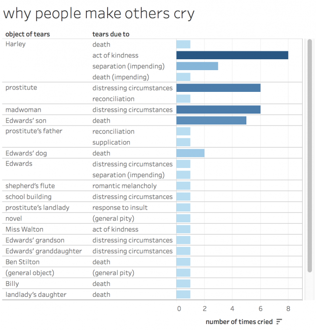
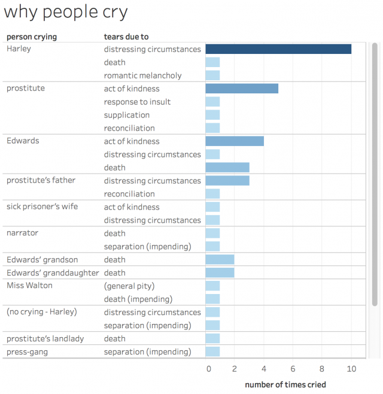
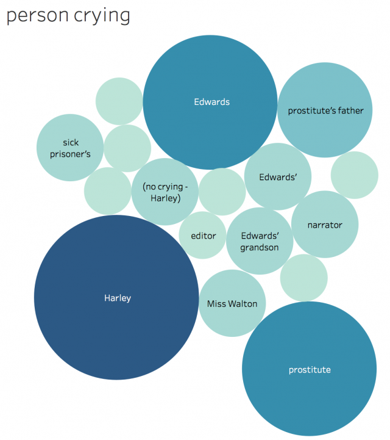
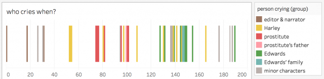

Title: thought-collector  
Author: Lawrence Evalyn

# Questions #

## Radcliffe authorship attribution? ##

## what to do with so much lit? ##

My goal is to do something about the problem of literary canons. How can we cope with the sheer quantity of literature that exists? What is our goal, when we approach literature?

### how to select texts? ###

How do we select a small number of texts, to be "important" or "representative", from a larger body?

### what do we teach? in what context? ###

What texts should we teach to students? And how should we contextualize them?

#### "good" and "bad" texts ####

From my conversations with Jakob: I have two thoughts which are in tension with each other:

1, Whenever, in literary history, there is a "gap" in which "nothing is written" -- I tend to find that actually just as much was written as usual, but it is either not in the format we expect (e.g., theatrical rather than prose production) or it is, by contemporary standards, "bad."

1A, Whenever, in literary history, works are dismissed as "bad" -- whether his means they are morally corrupting, or poorly crafted, or designed according to unliterary or unserious standards, or simply popular with the "wrong sorts" of people -- I immediately want to read those texts, to the exclusion of the "good" works which stand in contrast to them.

2, I do believe, sentimentally, in the Power Of Literature, as a tool to shape and improve the self, to foster empathy, to... to be Morally Improving. Particularly in a pedagogical setting, particularly for young readers (particularly for myself as a young, marginalized person).

2A, I don't think it can possibly be the case that **all works of literature** are equally well-adapted to the **use** of literature for self-creation. Some texts take more work than others. Especially, again, in a pedagogical setting, where it is important both to provide historical context and to nurture each student's individual reading of the text. So, maybe... if we want to use literature to expand students' worldviews, inculcate empathy, teach humanistic thinking... some texts... will be Good for that... and others will be Bad.

I think the tension resolves for me, right now, in the conclusion that one must **study** everything, and **teach** only the most useful -- always keeping open a bridge by which a student may go from learner to researcher.

Also -- many times the "bad" texts through Idea 1 above are, really, socially marginalized texts of various kinds, which are highly likely to be "good" through Idea 2. The knowledge that there is more than one kind of Literature (and thus more than one kind of Life) is, in itself, one of the things that I think reading can most powefully provide to readers.

So, I am practically allergic to the mere thought of trying to identify Good and Bad texts -- by my own instincts I will then end up only wishing to spend time on my Bad ones -- but I do feel like there is space here to distinguish between the **multiple** uses of literature. If there are **many** lists of Good Books, does that address the fundamental problem at all???

##### morally good ways of reading? #####

(Controversial opinion: I do think there are, actually, morally "good" books, or at the very least, morally good ways of reading; it is by no means the default state of all literature that it will increase empathy and understanding. Moreover, if literary scholars do not take up the task of sorting these things out, surely it can't be someone else's job. But also, censorship is obviously useless and wrong. So it must be the ways of reading, not the things read, which it is our responsibility to suss out...)

(Can reading from a distance be empathetic? or moral? or reparative?)

##### One of the ideas that was mentioned but not developed #####

One of the ideas that was mentioned but not developed at MLA was that, if one wishes to teach principles of justice, if one wishes to turn students' personal distress into pro-social empathy, one must choose to teach different texts. So I guess my question is: which eighteenth century texts should we teach? And how?

Can that be my question??

##### I think Sedgwick has my answer to "why DO we study #####

I think Sedgwick has my answer to "why DO we study literature anyway" and "what makes literature so different from history":

"The desire of a reparative impulse... is additive and accretive. Its fear, a realistic one, is that the culture surrounding it is inadequate or inimical to its nurture; it wants to assemble and confer plenitude to an object that will then have resources to offer to an inchoate self."

"What we can best learn from such practices are, perhaps, the many ways selves and communities succeed in extracting sustenance from the objects of a culture - even of a culture whose avowed desire has often been not to sustain them."

It requires research and study, in order to identify and disentangle the many projects and effects within a work; we must know which parts to discard and which to nurture, to render something useful to ourselves, and we must know what exists for us to repurpose: this is why I study literature. And it requires instruction in order to allow students to get past, e.g., "I thought I was supposed to respect Mrs Bennet" to the literary riches within: this is why I teach literature.

(Literature, unlike history, is permitted artistic license.)

This constant re-translation allows us to continue conferring and experiencing value to the work of previous generations. I don't value the past or tradition simplistically, or for the virtue of merely being older; but we do not always have to reinvent the wheel, and seeing that things were different in the past can allow us to remember that they will be different in the future.

(Though I suppose, since I proceed on the assumption that it is not possible to perceive or understand the "now," I do often dismiss the contemporary as insufficiently informative to be getting on with.)

### how to identify genres? ###

How do we make sense of intergeneric connections? What is a genre? Why do we have them? What are they for?

### how do literary fads move? ###

do literary fads emerge in plays, poems, and prose simultaneously, or move through them sequentially?

### how do audiences differ? ###

How different are the writers and audiences for each medium?	

### what is "normal" in the 1790s? ###

What do my corpora tell us about what was 'normal' during my decade?

What does it mean to be "normal" or to seek the "normal" over the exceptional?

### literary triage ###

What is the goal of the field? To triage texts based on their "importance" for students to learn? To triage texts based on the social, emotional, intellectual rewards they provide their readers? Both, obviously, but: how to do either?

## how political is 1790s lit? ##

I also anticipate finding new insight into the forms and popularity of political writing in the period: how much of the work being consumed is presented with explicit political aims?

### what genres for what politics? ###

What mediums are most-used for different political positions?

## author case studies ##

In a somewhat separate line of inquiry, I will explore in-depth the works of the individuals authors under consideration: how do they use each of the generic mediums available to them? How do they adapt their ideas to each form, and how do they conceive of each audience? 

### how do they use genre? ###

how do they use each of the generic mediums available to them? How do they adapt their ideas to each form, and how do they conceive of each audience? 

### are they "representative"? ###

Both the macro and the micro views will merge in the question: are my key writers 'representative' of the popular written discourse in which they participate? What does it mean for a text to be 'representative,' and how should we find and understand outliers?

## women in carriages ##

### how often do women get grabbed? ###

How often, in 18thC novels, do women get grabbed into carriages? Is this a stock trope?

- Clarissa

- Emmeline

- ??? Wolfenbach?

### what happens when they're grabbed? ###

What typically happens to them once they get grabbed? Do men and women write different kinds of outcomes?

### why? is it Clarissa? ###

Is it because of Clarissa, or did it start before then?

### explaining to hbbo ###

me that novel is also the progenitor of the woman-grabbed-into-carriage-for-forced-elopement trope, as far as I can tell uh, are you worried about spoilers for Clarissa?

hbbo ahahahahaha no I am not

me well, he says he will kill himself if she doesn't talk to him in the garden, so she goes to the garden to talk to him he yanks her into a carriage to drive away to scotland where they can elope I haven't read this far myself, but evidently along the way he rapes her, and she eventually dies and then for my fields list every novel by a woman has had a scene where a woman gets grabbed into a carriage against her will for an elopement I actually asked one of my fellow 18thC scholars if this was a common trope or if I was imagining it, and she laughed and agreed that it's everywhere but in all the ones I read, what the women do, in the carriage, is they cry, energetically, refusing food or water or sleep

me for days until they are on the brink of death

me and then their attempted kidnapper has to call a doctor, and the doctor says, "you are going to kill this woman if you force her to marry you, do you love her or not??" and the man has to call off the elopement, and the doctor takes the woman home to his wife, and the doctor's wife chaperones her all the way home to her family (i.e., the man who currently owns her) and vouches for her virtue, and her reputation is preserved like: three novels in a row had this exact arc

me and it's just a FASCINATING response to Clarissa?? because it's not a fantasy of being less vulnerable than Clarissa, right, it's not about having some power she didn't have: it's about... the world just rewarding you for your suffering and endurance?

hbbo ... sorry for vanishing earlier; it was almost time for me to take off & this dude called me with six complaints, & then I drove home & watched "Rope" with Gins. But yes, I definitely see where you're going here! It's a mode of changing the world surrounding the heroine, rather than changing the heroine to suit the world

## Shakespeare in the 18thC ##

### what plays get quoted most? ###

What parts of plays?

#### Frequently Cited Passages Across Time: New Methods for Studying the Critical Reception of Texts -- Sierra Eckert and Jonathan Reeve ####

Frequently Cited Passages Across Time: New Methods for Studying the Critical Reception of Texts -- Sierra Eckert and Jonathan Reeve

	•	Code might be re-usable for Shakespeare project, open-source: github.com/lit-mod-vis/middlemarch-critical-histories

### do men and women use Shakey differently? ###

### which writers write from full plays, which from extracts? ###

### is Shakespeare an 18thC author? ###

## 18thC transitional tragedy ##

### can I spot the "first" plays to make shifts? ###

Can I make a "canon" of "first outliers" over time?

### what is the role of the audience? ###

If the audience is a node in the social network, can we tell who they are meant to sympathise with?

## what is left out of corpora? ##

### is ECCO "representative"? ###

### is HathiTrust "representative?" or reliable?? ###

### ECCO timeless, ESTC timely ###

As perhaps might have been anticipated, the ECCO corpus emphasizes "timeless" literary and philosophical works, whereas the ESTC corpus is dominated by "timely" advertisements, government bulletins, and ephemera.

(Based on 50 topic models of titles of ESTC works vs ECCO-TCP, both from 1789-99)

## what is the "theory" of literary history? ##

Moretti: evolutionary selection? Centre-periphery?

Or is it something else?

Why do we need a theory?

"I set out to explain the logic behind literary survival and oblivion" (Moretti Distant Reading 145)

## can I make a reverse recommendation engine? ##

Is there a way I could use JSTOR information & ESTC information to identify popular but under-studied writers? Or to generate for any given reader a list of five names likely to be very different from what they're currently reading? Reverse recommendation engines?

## Sarah Scudgell Wilkinson ##

http://orlando.cambridge.org/public/svPeople?person_id=wilksa

## is decanonization my model? ##

Like decolonialization? (Though that is likely an appropriative framework)

### how can we decanonize Wordsworth? ###

(And Coleridge and the other Romantics... especially Blake)

One part is bursting open all their self-indulgent mythmaking

### how can we decanonize Jane Austen? ###

Goodness gracious, do we even WANT to?

But she's really so unlike everyone else...

#### When and how was Austen canonized? ####

Broadview p XL: "Austen's works are now seen to hold a central position in the history of the novel" --- did they not before??

### no real canon of 18thC lit ###

Part of what frustrates me is that these important, fascinating novels aren't in any kind of canon, that the canon just skips from Richardson to Austen, despite the fact that Austen is a wild aberration.

## are Gothic novels usually fragmentary? ##

They seems to be prone to the proliferation of subplots, but they are much more invested in plot threads and wrapping-up than, say, The Man of Feeling, or Tristram Shandy, which are frankly picaresque

(Sentimental narratives are fragmentary, often skipping straight to the good bits --- if the gothic has its roots in the sentimental, is this something that carries over? Or does the gothic laboriously fill in all the connective tissue?)

## ESTC Qs ##

### What models of 18thC publishers' social networks already exist? ###

### Are Hookham, Carpenter, and Hookham & Carpenter three publishers or one? ###

### How big were the print runs for each of the works published by my four authors? ###

### Does the ESTC works-per-year graph match the Garside?  ###

ESTC:

![][PastedGraphic]

### Is the number of "null" (unsigned) authors associated with the Minerva Press proportionate to the overall number of "null" authors? ###

## potential experiment ideas ##

### Network of the Chawtons? ###

#### ? ####

### Networks of 18thC plays? ###

#### ? ####

### Genre identification? ###

#### ? ####

### Bibliographical metadata? ###

#### ? ####

### Text analysis of Corvey? ###

#### ? ####

## can I use reviews to identify popular / important works? ##

Where are all these reviews collected? Can I put them in my relational database?

Can I come up with some kind of measure like "surprise" in that model of Darwin's reading habits, to see when something makes a splash?

Can I see which things get used as points of reference in reviews of other works?

## Why was Frankie a "revival" of Gothic but not others? ##

read all the Gothics that also came out in 1818, for context for Frankenstein: why was it remembered as a revival when the others weren't?

## how can Powis Castle satirize in 1788 something which ##

how can Powis Castle satirize in 1788 something which barely even exists yet?

## will Garside just GIVE me data 1789-99???? ##

Can I... ask?

### will William St Clair????? ###

## read just first and last pages of works?? ##

Can I make useful assessments by reading just the first and last page of a whole bunch of things??

## Network of reuse of character names in the Gothic ##

Network of reuse of character names in the Gothic??

## in/out-degrees of she-heroines in networks? ##

I would be really interested to know each character's ratio for being the source vs the target of speech -- how much more does Hamlet talk to others than they talk to him? How does he compare to everybody else? This seems really easy to calculate from the information already found, I just never thought to look at it until the student's thesis mentioned Hamlet's in-degree and out-degree numbers.

## sideline later: timeline of Revolution ##

see if French Revolution deaths track with summer heat or escalating price of bread (hypothesis: yes)

my guess is, everybody gets murderous when they are hot, hungry, and worried that they are losing their various wars

the "status of the wars" would be harder to stick onto an X-axis but the overall thing appeals as a response to the famous map of Napoleon's march into Russia

Alex: "sure -sounds fab. that one I also check off - though I'd argue for after fields, after a couple of articles are in with readers"

## crying in jails ##

Is the stock sentimental trope of crying in a jail marked by continuity or discontinuity in its meaning, during the French Revolution?

[Crying in a jail means something different before and after the Revolution; the uses of emotion gain new possible powers] [So these same sentiments gain new importance and need a new name, the Gothic, when they collide with political realities]

### Vicar of Wakefield crying in jail ###

### Two Shoemakers crying in jail ###

Two Shoemakers: The gaoler observed him drop a tear, and asked the cause. I cannot forget, said he, that the most dissolute of these men is still my fellow-creature. The same GOD made them; the same SAVIOUR died for them; how then can I hate the worst of them? With my advantages they might have been much better than I am; without the blessing of GOD on my good Minister's instructions, I might have been worse than the worst of these. I have no cause for pride, much for thankfulness: let us not be high-minded, but fear.

## rabbit hole: glow-worm as poetic subject ##

why are there so many poems about glow-worms? I've never seen the glow-worm discussed as a standard poetic subject, but after a certain point everybody seems to write a glow-worm poem. Is it connected to all the walking around in the middle of the night they apparently do?

### Percy Shelley's the Sky-Lark ###

    Like a glow-worm golden

 

        In a dell of dew,

 

      Scattering unbeholden

 

        Its aërial hue

 

Among the flowers and grass which screen it from the view:

#### Shelley's Prometheus Unbound ####

"Look again,---the flames almost

    To a glow-worm's lamp have dwindled:

The survivors round the embers

    Gather in dread." (Norton 812)

### Charlotte Smith's the Glow Worm ###

WHEN on some balmy-breathing night of Spring

The happy child, to whom the world is new,

Pursues the evening moth, of mealy wing,

Or from the heath-bell beats the sparkling dew;

He sees before his inexperienced eyes

The brilliant Glow-worm, like a meteor, shine

On the turf-bank;--amazed, and pleased, he cries,

'Star of the dewy grass!--I make thee mine!'--

Then, ere he sleep, collects 'the moisten'd' flower,

And bids soft leaves his glittering prize enfold,

And dreams that Fairy-lamps illume his bower:

Yet with the morning shudders to behold

His lucid treasure, rayless as the dust!

--So turn the world's bright joys to cold and blank disgust. 

#### Charlotte Smith <3 natural history ####

Charlotte Smith is particularly invested in natural history --- cf Rural Walks

##### natural history as consolation for world #####

Lisa V's paper at CSECS: natural history as a consolation when life disappoints you / coping method for the pains of worldly life

### a new trope - natural history? ###

there are no such poems in Middle English

so it is not just night wandering

bc they do that in middle ages

it is not renaissance trope either that I know of -is it not perhaps associated with natural history movements - experiments on tiny creatures, microscopes etc

### chronological connection? ###

they might start to appear around 1800 --- Charlotte Smith loves night wandering but doesn't write about glow-worms until the 6th vol of Elegiac Sonnets

### Grasmere journal ###

"Glowworm Rock"

LOTS of nighttime walks featuring glowworms

Glowworm Rock Still by the side of the old road just north of the junction with the new road at White Moss. 'We have been in the habit of calling it the Glow-worm Rock from the number of glow-worms we have often seen hanging on to it as described.

### "Proud Maisie" Walter Scott ###

Proud Maisie

Proud Maisie is in the wood

   Walking so early;

Sweet Robin sits on the bush,

   Singing so rarely.

"Tell me, thou bonny bird,

   When shall I marry me?"---

"When six braw gentlemen

   Kirkward shall carry ye."

"Who makes the bridal bed,

   Birdie, say truly?"---

"The gray-headed sexton

   That delves the grave duly.

"The glowworm o'er grave and stone

   Shall light thee steady;

The owl from the steeple sing,

   'Welcome, proud lady.'"

Walter Scott, 1818. Overheard by some characters in The Heart of Midlothian.

### Wordsworth ###

the Glowworm The poem, 'Among all lovely things my Love had been', W's gift to D on his return from seeing Mary in Middleham the previous week; see 20 Apr. 1802 for an account of the poem's composition on horseback (Calvert's horse). It is about the finding of a glow-worm for 'Lucy' to see. 'The incident', wrote W when he copied it out to send to C that same night on reaching Grasmere, 'took place about seven years ago between Dorothy and me' (EY, p. 348). The gesture was delicate at Racedown in 1795, and the poem about it is particularly delicate in Apr. 1802; it clearly did reassure D that W's intended marriage would mean no diminution of his love for her.

### Cowper ###

The Nightingale and the Glow-worm

#### Translations from VINCENT BOURNE ####

Translations from VINCENT BOURNE.

<< Previous section   Next section >>

1. THE GLOW-WORM,

1.

BENEATH the hedge, or near the stream,

A worm is known to stray;

That shews by night a lucid beam,

Which disappears by day.

2.

Disputes have been and still prevail

From whence his rays proceed;

Some give that honour to his tail,

And others to his head.

Page  336

3.

But this is sure---the hand of might

That kindles up the skies,

Gives him a modicum of light,

Proportion'd to his size.

4.

Perhaps indulgent nature meant

By such a lamp bestow'd,

To bid the trav'ler, as he went,

Be careful where he trod:

5.

Nor crush a worm, whose useful light

Might serve, however small,

To shew a stumbling stone by night,

And save him from a fall.

6.

Whate'er she meant, this truth divine

Is legible and plain,

'Tis power almighty bids him shine,

Nor bids him shine in vain.

Page  337

7.

Ye proud and wealthy, let this theme

Teach humbler thoughts to you,

Since such a reptile has its gem,

And boasts its splendour too.

### Ann Radcliffe ###

#### poem in Udolpho ####

There's a glow-worm poem in Udolpho!!

#### "On the Supernatural in Poetry" ####

"Oh, I should never be weary of dwelling on the perfection of Shakspeare, in his management of every scene connected with that most solemn and mysterious being, which takes such entire possession of the imagination, that we hardly seem conscious we are beings of this world while we contemplate 'the extravagant and erring spirit.' The spectre departs, accompanied by natural circumstances as touching as those with which he had approached. It is by the strange light of the glow-worm, which ''gins to pale his ineffectual fire ;' it is at the first scent of the morning air–the living breath, that the apparition retires. There is, however, no little vexation in seeing the ghost of Hamlet played. The finest imagination is requisite to give the due colouring to such a character on the stage; and yet almost any actor is thought capable of performing it. In the scene where Horatio breaks his secret to Hamlet, Shakspeare, still true to the touch of circumstances, makes the time evening, and marks it by the very words of Hamlet, 'Good even, sir,' which Hanmer and Warburton changed, without any reason, to 'good morning,' thus making Horatio relate his most interesting and solemn story by the clear light of the cheerfullest part of the day; when busy sounds are stirring, and the sun itself seems to contradict every doubtful tale, and lessen every feeling of terror. The discord of this must immediately be understood by those who have bowed the willing soul to the poet.""

## pursue: Austen looms over all of this... ##

I sort of --- suddenly remembered that she is, like Shakespeare, a monumentally canonized author, and that I am interested in such figures, and that she is in my period --- and I got very curious about reading her in relation to Radcliffe, Smith, and Robinson, all of whom were celebrities in the decade before her

### her shadow isn't interesting ###

I'd rather just play around with Smith as Smith, rather than Smith in the shadow of Austen

### Austen & Radcliffe ###

having re-read Radcliffe, I could easily imagine a Radcliffe fandom along the lines of an Austen fandom --- Udolpho really is very good

the Radcliffe-Austen connection ought to be pretty well-trod, though; Northanger Abbey is famously a rewriting of Udolpho

Alex: "yes very - but you are not talking about Austen's reading of Radcliffe so much as her reading v. their reading?"

### Austen as 1790s author? ###

it might be interesting, actually, to look just at the juvenilia that was written during my decade of interest

oh, especially her history of england, which is a riot --- in conversation with the general problem/project of national history in the shadow of the revolution

## how is Marie Antoinette represented when? ##

Do poems about her in prison take place before she is actually imprisoned, or not?

Does her representation shift in time with her location/status as an actual person, or in time with shifting ideas about the revolution?

## apocalyptic visions ##

How common are these? Is it women writing them? Are they popular? Do people write about them?

"Beachy Head", "Eighteen Hundred and Eleven", maybe some Blake?? "Ozymandias"

## Wordsworth's Salisbury Plain? ##

What was it? Any connection to More??

## Palmyra ##

### Barbauld "1811" ###

"In desert solitudes then Tadmor sleeps"

## What were nuns up to? ##

Is there a difference between the actual nuns of the world, and the literary depiction of nuns?

### convents as woman-storage ###

Women "bury themselves" in convents --- it's a living death

(But there's always this anxiety that they're not dead enough, that they are too beautiful or too rich to be discarded from consideration)

### women have leisure in convents ###

"I came to learn that women have never had a history or culture of leisure. (Unless you were a nun, one researcher later told me.) That from the dawn of humanity, high status men, removed from the drudge work of life, have enjoyed long, uninterrupted hours of leisure. And in that time, they created art, philosophy, literature, they made scientific discoveries and sank into what psychologists call the peak human experience of flow. Women aren't expected to flow. I read feminist leisure research (who knew such a thing existed?) and international studies that found women around the globe felt that they didn't deserve leisure time. It felt too selfish. Instead, they felt they had to earn time to themselves by getting to the end of a very long To Do list. Which, let's face it, never ends. I began to realise that time is power. That time is a feminist issue."

--- 

Brigid Schulte: Why time is a feminist issue 

### was the bleeding nun a common story? ###

## natural / unnatural family relations ##

### Hannah More ###

The Two Shoemakers: much discussion of "unnatural" family

	•	Part 4: "He was just able to sob out, My unnatural father leaves me to perish, and my injured friend is more than a father to me. Stock told him that one proof he must give him of his repentance was, that he must forgive his father, whose provocation had been very great."


### William Hazlitt ###

"This is but natural: it is but natural for a mother to have more regard for her son than for a whole city; but then the city should be left to take some care of itself". Review of Coriolanus; Norton p 550

## Emily St Aubert has 3 girlfiends ##

The Italian woman, the peasant girl, and then Blanche --- and it is Blanche who most fully sees her to happiness

(Can I read something related to Between Women to understand this?)

### she also has 3 boyfriends ###

Morano and the fishing-house stalker seem like basically fine boyfriends --- why is Valancourt so superior?

## Is the dislike of "new money"... justified? ##

Broadview p XLV: "To possess a good deal of money as a result not of belonging to the 'landed gentry' but rather of having amassed it through commercial activity was considered more than faintly disreputable." --- That commercial activity was probably partly unsavory or exploitative; without a local community to whom one has obligations, greed has full reign

## ending with an ad for next time ##

### Tristram Shandy ###

### Hannah More ###

### William Hazlitt ###

On his first acquaintance with the poets---

"Enough of this for the present. 'But there is matter for another rhyme, / And I to this may add a second tale.'" (Norton p 564)

### Wordsworth Heart-Leap Well ###

'But there is matter for another rhyme, / And I to this may add a second tale.'

## Hazlitt on Coleridge on fame ##

### Lewis too popular ###

As per Hazlitt, Norton p 561

"He had been to see the Castle Spectre by Monk Lewis, while at Bristol, and described it very well. He said 'it fitted the taste of the audience like a glove.' This ad captandum merit was, however, by no means a recommendation of it, according to the severse principles of the new school, which reject rather than court popular efffect."

### Thompson appropriately popular ###

Norton p 563, Hazlitt on Coleridge:

"It was in ths room that we found a little worn-out copy of the Seasons, lying in a window seat, on which Coleridge exclaimed, 'That is true fame!' He said Thompson was a great poet, rather than a good one; his style was as meretricious as his thoughts were natural. He spoke of Cowper as the best modern poet. He said the Lyrical Ballads were an experiment about to be tried by him and Wordsworth, to see how far the public taste would endure poetry written in a more natural and simple style than had hitherto been attempted, and making use only of such words as had probably been common in the most ordinary language since the days of Henry II."

## is 1793 copyright a big deal? ##

Can I detect the influence of a change in France's copyright in 1793? Is it as big a deal as William St Clair suggests?

## Byron and Southey are interesting! ##

Southey is even interesting in the 1790s! Writes a LOT, in a lot of forms, with shifting political allegiances

## pirate press publishes against author's reputation ##

Queen Mab kept in print in pirated editions by radical press, to his embarassment (Norton p 749)

Southey's radical early writing revived in 1820s to his embarassment by pirate press (Norton, in the bit on Byron's parody of Southey)

The pirate press prints what sells regardless of whether it's HOW the authors now want to sell themselves

### add copyright laws & libraries to timeline ###

From William St Clair

## can I reconstruct a month in detail? ##

Track down, e.g., weather, exactly what was published each day, letters and diaries from as many people as possible --- how much information can I get on the happenings of a single day?

## gaps: published, archive, corpus ##

"the gaps between "the published" (all literary works in history), "the archive" (the portion of what was published that has been preserved and is now increasingly digitized), and "the corpus" (the segment of the archive selected for a particular research question)" (Katherine Bode)

Also mentioned in pamphlet 11 by stanford lab

## who wins Romantic poetry contests? ##

### Keats v Hunt ###

On the Grasshopper and Cricket

The poetry of earth is never dead:

When all the birds are faint with the hot sun,

And hide in cooling trees, a voice will run

From hedge to hedge about the new-mown mead;

That is the Grasshopper's--he takes the lead

In summer luxury,--he has never done

With his delights; for when tired out with fun

He rests at ease beneath some pleasant weed.

The poetry of earth is ceasing never:

On a lone winter evening, when the frost

Has wrought a silence, from the stove there shrills

The Cricket's song, in warmth increasing ever,

And seems to one in drowsiness half lost,

The Grasshopper's among some grassy hills.

The above sonnet was written in competition with Leigh Hunt.

### Shelley v Horace Smith ###

Ozymandias

## How can we read between the lines without being paranoid readers? ##

How can we read between the lines without being paranoid readers???????

I'm currently fascinated / mesmerized by this 1960s song "The Masochism Tango": youtube.com/watch?v=TytGOe...

Like, it's actually a fun kinky song, right? Except for what feels like a few points that go "too far" (I think strategically) and thus safely turn the whole thing into a "joke" (and therefore something that can be said in public)

Especially the bit at 3:20 about cigarette burns; it gets a laugh, but he sings it straight, and I know folks who'd be into that.

It makes me have more sympathy for people who want to argue that some 18thC Gothics are trying to subversively smuggle in radical ideas despite not fully committing to those ideas

even if you have to pretend that you're only kidding or otherwise 'take it back', to simply say certain things outright in the first place can be powerful..

..and the self-censored versions can circulate publicly in order to get into the hands of people who know how to decode them

So now I'm thinking of how the Toronto gay scene (in the 70s?) would use newspaper articles "warning" people away from dirty sinful gay hotspots, using lots and lots of detail in order to let other gay people know where to go and what to do

I dunno how to put all of that together, but it feels important somehow! How can we read between the lines without being paranoid readers?

## but, okay, art can't fix the apocalypse. ##

Tom Lehrer's chillingly relevant youtube videos about the nuclear threat (https://www.youtube.com/watch?v=frAEmhqdLFs) feel both incredibly powerful and obviously inefficacious. (Here we are again, here we are again..) --- I can make connections to the 1790s I'm sure, but what do we do with that?? Saying: "This person saw what was happening, and this is how they coped" --- does that mean we should cope that way too?

(I'm also reminded of how often I see people ask "How can I help with X world event?" and how often I see them get the answer "keep talking about it and make sure nobody forgets it's happening" --- attention does not equal solution, but it can FEEL like one. Can we actually learn to do something else?)

### Lehrer on folk songs ###

https://www.youtube.com/watch?v=UQfaRSeaMZQ

Also very familiar!

## research methods for corpora comparisons ##

My biggest-scale question is: I have all of these different corpora of stuff from 1789-99. How can I compare what they contain? If people only worked with the absolute easiest corpus to access (ECCO-TCP), what would they be leaving out?

I want to develop a consistent ontology (in the computer science definition of the word) to apply to all of the corpora, so I can directly compare what kinds of materials each includes. It's important for this ontology to be able to tell me things like "this corpus consists entirely of plays" (because one of them definitely does) but I don't know how to know in advance what categories I'll need. (I'm going to ask my mom about this, ontologies are her jam.)

Then I want to look at each individual corpus and classify its contents into my ontology categories. I'll probably do this computationally also, but it's important to me to classify at least some of each corpus by hand, to check (or train?) my computational approach. Since I can't classify 52,000 things by hand (1 minute per thing = 866 hours) I want to take a random sample, classify *that*, and say "the whole thing probably looks roughly like this." I'll probably be classifying just by title / title page so they should all be able to "respond," but if I want to look at how well those titles reflect the actual content I might start bumping up against works that I can't access (and also I'll want to use smaller samples so I can spend longer on each item.)

I'd like to use the smallest sample that is still acceptably trustworthy. I don't know what is considered acceptably trustworthy: 70%? 98%?

I have several corpora -- smallest one 466 items, biggest one 52,000 -- so I am looking for a calculation to run each time I decide to sample a new corpus. (My first instinct was to pick one number and sample that many of each one, but on reflection, that's... not right, is it? Should I sample the same *percentage* of each one?)

I'm basically treating each corpus as a non-random sample of the platonic ideal of "Printed Works In Britain 1789-99" and trying to see how each corpus represents that platonic ideal, and also trying to inch closer to that platonic ideal.

## "schools" of authors? ##

Could I just do the 'school of Radcliffe' and the 'school of Charlotte Smith'? Based on the network graph from DHSI last year?

What schools were 18thC readers familiar with?

Why do we need to sort authors into schools? What makes the "Lake Poets" different from the "School of Radcliffe"?

## speed-read in bulk? ##

It does sometimes feel like I will have no idea what I'm talking about until I've read a hundred 18thC novels... I should make a list of what I've actually rolled my eyes past, and think about some habits of, e.g., using ReadMe! to speed-read more of these. I find that I get a lot out of even a very superficial read of the works as a whole.

## narratology? ##

At MLA, I most enjoyed a panel on "anti-marriage plots"-- it made me want to look at what narratologists are up to and how I might dip my toe into that field.

Ontology of marriage plots --- esp incest plot

## how many titles promise a mystery? ##

What percentage of books promise in their titles some kind of secret or mystery to be discovered? This is the kind of question that would be more interesting if two different time periods were being compared...

## sentimental novels > Gothic ##

IS the sentimental novel part of what I am trying to do here?? Just had a great talk with Ashley about the development of the sentimental novel -- 1750s tied to religion, mostly men; 1770s still male and respectable and now emotion as its own moral code; 1790s develop it into revolutionary sentiment, becoming tied to women; by 1810 it's been subsumed into women's Gothic writing and lost its potential for respectability

Narrative fragmentation and suspense typical of the sentimental novel is also hugely typical of the Gothic -- Vicar of Wakefield and Man of Feeling both cut away from dramatic moments, withhold information, intentionally sustain anxiety. The Gothic is a natural amplification! But instead of catharsis through tears, it... all gets resolved into rationality?

### why is everyone so into novels? ###

Is the sentimental novel part of what I am trying to do here? Am I interested in the novel as a form at all? Why is everyone else so interested in the novel to the exclusion of other literary forms???

Am I interested in the poetry, actually? How can I see which generic form dominates the decade?

## how to calculate popularity ##

on how to calculate popularity: https://www.jstor.org/stable/3844307?seq=1#page_scan_tab_contents

and the previous items in the controversy (Blayney article, Farmer and Lesser article, Blayney rebuttal)

## ideological purity unecessary and impossible ##

One of the lessons we should probably learn from the French Revolution is that ideological purity is not only unecesseary, it is impossible.

## individual word studies seem cool ##

HathiTrust shows a collection of all uses of the term "Hottentot" in 18thC periodicals --- is there anything similar I am curious about? (Glow-worms, of course...)

## what kinds of libraries were there? ##

Circulating libraries, yes; do we have info on private libraries at all?

More importantly --- what social libraries existed?? mechanics libraries, or mutual education societies, etc --- these things get big in the 19thC, when do they start?

## can I prove that they were hangry? ##

I'm particularly interested in the role of caffeine, actually.... But I don't think this is really a literary question?

# Observations #

## novels as puzzle-solving practice ##

### Radcliffe vs Austen ###

In Radcliffe you know who the heroine should marry; the mysteries are all cosmetic (though there's always the slight chance that she will die before the end and someone else will marry the nice gentleman); in Austen, the stories are all high-stakes mysteries that puts the reader in the same shoes as the heroine-investigator as she tries to figure out who is a good person for her to marry.

### Fielding ###

There's lots of writing on Fielding staging the interpretation of evidence and testimony

## "genres are problem-solving devices" ##

What it means for readers to 'like' something: "literary genres are problem-solving devices, which address a contradiction of their environment, offering an imaginary resolution by means of their formal organization. The pleasure provided by that formal organization is therefore more than just pleasure -- it is the vehicle through which a larger symbolic sentiment is shaped and assimilated." (Moretti Distant Reading 141)

## there is no "quintessential" genre example ##

I've been looking, but I haven't been able to find anything that ONLY replicated one genre's set of tropes without including anything a bit original or incongruous; similarly no one work is able to contain ALL generic tropes. There is no "typical" Gothic novel 

### Genre is like Aristotelian species? ###

Genre operates like Aristotelian species, where we see individual examples and mentally combine them into a created "ideal" or perhaps placeholder? (Does this have... useful implications? Does Cai have anything to say about this?)

### 1820s parody gothics are gothic ###

The second flourishing of the Gothic in the 1820s as parody, meaningfully is Gothic.

### Gothic checklists have no referents ###

Checklists of Gothic tropes functioned as successful pointers, despite the fact that no one work completed all the checklist items.

## be true to the variety of the period, but also true to its chief emphasis ##

be true to the variety of the period, but also true to its chief emphasis.

### account for variety with information density ###

Minard is actually making a strong and brutal argument in his chart -- against war, against Napoleon, and against history as the biography of celebrity. I need to do a lot of actual research first, to figure out what I think is true, and why I think it, but I will know that I have succeeded, I think, if I can produce something half so rich and persuasive.

Right now this means that I am throwing out my current dissertation outline, which separates things based on which corpus I am pulling my information from. I will describe my methods in the most voluminous appendices the department has ever seen if I must (and I strongly suspect that, in the end, I must) but I am on a quest for astonishingly dense synthesis.

I think this how how one properly accounts overwhelming detail and variety: lots of different bits of information all correlated with each other.

### computations don't allow generalization ###

One of the things I like about computational methods is that, ultimately, there are no glossy simplifications --- one must touch and somehow *account for* the things that don't fit the pattern

## ESTC: publishers visible over authors ##

The decade 1789-99, according to the ESTC corpus, is driven by publishers at least as much as it is by authors. At this scale, no one author can be seen to have particular impact. Even Paine, and More, and Wesley are dwarfed by the volume of work produced by "Great Britain", and dwarfed again by the works by "null" authors who were not only unsigned at the time but elude bibliographic documentation now.

## ESTC: author development = publisher choice ##

Radcliffe is remarkably stable in her choice of publisher

When Smith begins to branch out into more political radical works, she needs to branch out into new publishers as well

Robinson: ???

More accomplishes her stunning volume of work partly by being a publisher as much as she is an author. (See: The Apprentice's Monitor) Her shifting publisher data is mostly information on the Cheap Repository Tracts. [But I was cautioned that these dates are less reliable! Ignore chronological information over sheer quantity? This also addresses the other difficulties re: there being too many publishers to show as a timeline]

### How often do authors switch publishers? ###

## ESTC: prominence of the "back catalogue" ##

Older works will have had more years for people to potentially read them, so that an increase in an author's popularity also increases the relevance of their older works. A new bestseller like Udolpho supplements The Romance of the Forest, it doesn't supercede it. Ditto Charlotte Smith's Elegiac Sonnets.

### account for the impact over time of works which cannot ###

account for the impact over time of works which cannot extend back in influence to before they were written, but most certainly do extend forward infinitely; no work is confined to a single moment.

Older works will have had more years for people to potentially read them, so that an increase in an author's popularity also increases the relevance of their older works. A new bestseller like Udolpho supplements The Romance of the Forest, it doesn't supercede it. Ditto Charlotte Smith's Elegiac Sonnets.

When my inquiry starts in 1789, there is already an enormous catalogue of works of active interest to readers of the day; it's not a blank slate.

(Am I impressed by longevity?? I think what matters to me here is that this is a way that "normal", "average" books have great impact: they form a context/mediascape that only makes sense as a whole.)

## canonical authors aren't obviously exceptional ##

"rivals: contemporaries who write more or less like canonical authors... but not quite, and who... seem to be the largest contingent of the 'great unread'" (Moretti Distant Reading 67)

There are so many of them and they look at first glance so similar

They reveal that our canonical authors aren't inherently exceptional

## always expect power-law distribution ##

"Ha-ha! No one expects the power-law distribution!"

We want things to be a few, simple, balanced categories --- we especially want there to be two equally-matched sides of a binary --- but in fact just about everything follows a power-law distribution, which will necessitate a long-tail "misc" category.

### "thinking other than dualistically" ###

Sedgwick's project in Thinking Feeling was "the ambition of thinking other than dualistically" (p.1)

## 18thC titles intentionally signal contents ##

The title of a work was the main 'advertisement' available to a text (even author names played a minor role!) so 18thC titles are doing a lot of heavy linguistic signalling of the contents intentionally to locate/interpellate their audiences

## chapbook titles iteratively seek audiences ##

What I'm finding extra-fascinating about Hannah More's pamphlets is how different titles seem to be packaging the same work to different audiences. Most obvious is "Dame Andrews: a ballad" and "Dame Andrews: a tale", but there's also "The two wealthy farmers, or, the history of Mr. Bragwell," which is sometimes "The history of Mr. Bragwell; or, the two wealthy farmers." (That one might just be normal. But even then, it's interesting that some fluidity of title is normal...) And of course there's the labeling of some things as "Cheap Repository" or "A Sunday Reading". "On carrying religion into the common business of life" looks like it is part of "The Two Shoemakers" but it's so often presented entirely independently.

I feel like I'm seeing a bit of a pattern, where some things get one printing and essentially fizzle out, and others are significantly more popular.

## More beats Radcliffe in number of printings, but Radcliffe harder to avoid? ##

![][PastedGraphic1]

More printed way more titles, but they existed in their own literary context that could be entirely ignores, whereas Radcliffe's few titles were discussed much more widely (?)

How to account for difference in prominence

## nitpicks ##

### Smith definitely goes to the headland ###

"SONNET LXX. On being cautioned against walking over a headland overlooking the sea, because it was frequented by a Lunatic." --- Not "on cancelling my walk because I've been cautioned!"

"In moody sadness, on the giddy brink, / I see him more with envy than with fear;" --- why would this not be literally true? (At least as per the poetic premise)

### WW helped with the root ###

It's buying into Wordsworth's weird aesthetic fetishization of poverty to say that a poor old man is defined by his struggle with a root and has nothing left after the wandering poet slices it for him. There is another root. There are a lot more roots. There are also clothes to wash and furniture to mend and a thousand, thousand other household labours, which his wife has been doing! If anything, the sadness of his gratitude is that, as the poet knows, cutting one root does nothing to change the actual condition of the man's life.

## reparative reading ##

"The desire of a reparative impulse... is additive and accretive. Its fear, a realistic one, is that the culture surrounding it is inadequate or inimical to its nurture; it wants to assemble and confer plenitude to an object that will then have resources to offer to an inchoate self."

"What we can best learn from such practices are, perhaps, the many ways selves and communities succeed in extracting sustenance from the objects of a culture - even of a culture whose avowed desire has often been not to sustain them."

### DH: thing you study is a thing you create ###

You make/remake the object of your inquiry according to your own interests, priorities, lens, whims --- you nurture it, claim it, become intimate with it by manipulating it (deformance), using it, getting messy and tangled and confused with it.

The decade 1789-99 is suddenly *about me*, and *mine*.

### readers can get sustenance anywhere ###

*Anything* can become the thing that gets you through; some things might make the attachment easier than others, but the decision to attach lies in the reader, who returns to and re-interprets the text to shape it into the tool required.

**This is the reason that the canon is not useful.**

#### donoghue's lesbian history ####

me Which is -- a totally different way of responding to the flaws and insufficiencies of a text, and one that has intense appeal to me

hbbo reminds me of several chapters of that lesbian history by emma donoghue [Passions Between Women] I was reading a month or so ago

me oh! tell me more!

hbbo she talks a lot about how, like

hbbo the fact that a text that represents or misrepresents woman-woman desire, in a lot of ways, fundamentally hostile to that desire or AT THE VERY LEAST extremely ill-informed about it, doesn't mean that historical same-sex-attracted women didn't gain value from those texts, even if that value required different kinds of readings than intended

me ohhh, yeah! yeah, that's a perfect example, I think

#### how can women gain sustenance from misogynist literature ####

me that example appeals to me also because it gestures toward a reason for all of this discussion of non-paranoid reading to be called "queer theory", which initially seemed strange to me

hbbo yes!

me surely everyone can see that this is an often necessary reading practice, and an important part of literature's role in our lives the wilful remaking of a text into something that works for you

hbbo that is definitely the political context in which I've thought most about that general idea yes

me my own work is interested in the uses that 18thC basically-heterosexual women make of semi-misogynist literature

hbbo /me nods!

me (by basically heterosexual, I mean women who want to end up in happy companionate marriages with men)

## surface reading ##

I am most persuaded that my work has something to offer to the very recent conversation around "surface reading," and other ways of escaping paranoid critique. I think the theoretical principles of modeling, prototyping, and iteration, allow for richness and surprise. cf Heather Love, Sharon Marcus, Stephen Best, Cannon Schmitt, and a bit of Eve Sedgwick (also possibly Rita Felski?)

## edit anthologies in chronological order ##

Okay, but really, what **if** the Norton Anthology presented all the works in chronological order, instead of grouping them by author? 

### de-emphasize The Author ###

You could include author bios at at author's first appearance, but the whole system of biographical readings would break down.. instead, there would have to be running historical contextualization. It would make current ways of teaching inconvenient, but perhaps in productive ways: if you wanted to read a bunch of poems by one author, students would have to skip past the other writing that was produced in between, a tangible reminder of the time that actually did separate those works. It also makes it easier to sub in less "important" authors, when you're looking for a work to fill just one chronological slice rather, than an author whose ouevre will be broadly applicable.

### must decide "when" a work happens ###

Does a work get listed according it its composition? (Beginning of first composition, or end of last revision?) Its first publication? But "publication" doesn't apply to works that circulated widely in manuscript form --- date from the first time a copy was "distributed" to someone other than the author? (What about, e.g., Percy editing Frankenstein? Other manuscript works were surely revised in response to feedback, but Mary giving Percy a copy doesn't feel like "publication".)

Beginning of first composition is probably easiest (though still not easy) to actually pin to a fixed moment, but work change so much over the course of composition that the chronological conclusions drawn from this arrangement aren't likely to be fully useful. I like first publication to reflect when the work became less inchoate and entered into a broader literary conversation --- this is the point at which chronological connections seem most likely to be informative.

### cf Cox's(?) edition of Keats ###

Presented peoms and letters intermingled chronologically

### assumption: time matters more than person ###

A chronological anthology is structured by the assuption that the most important context for a work is not who it is by, but when it was produced. Author comes second. This reverses the traditional anthology (Norton etc), which is structured by the assumption that the most important context for a work is the author who produced it, with chronology as a second concern.

Author is of course an important component! But it can also promote the false idea that changes within an author's body of work are mostly due to personal matters or artistic evolution, rather than being responses to other works being produced or to changes in the world at large. 

### chronology demands decisions ###

To edit chronologically requires deciding, often at an astonishing level of particularity, exactly when a work first came into being. Almost no work is straightforwardly reducible to a single date, especially if one seeks to capture composition rather than publication: [Smith's sonnets, Lyrical Ballads, Coleridge --- but even Walpole and Lewis whose second editions make a different stir than their first].

#### publication = entry to conversation ####

I argue for organization by publication date over composition only partly because publication is more likely to be feasible. Many works in the period circulated as manuscripts or in private readings before publication (even Austen!) but it is the point of publication which marks an intentional, temporarily-fixed/timely entry into a broader public conversation.

## no such thing as an "author" ##

The idea of an author doesn't hold water: not just Dorothy Wordsworth is part of William Wordsworth's poems, but also Jane Austen's family is part of her novels; it's inaccurate to imagine them as self-contained founts of genius, all writing is collaboration with someone

### reading is collaboration ###

The conclusion I draw from that is 20% "so let's make sure we research things like the family joke in Northanger about the name Richard"

And 80%: All reading is a collaboration! So when you read something, especially when you're a wee student and you're handed some monument of Literature to read, that's not actually a one-way full of Great Knowledge from the Great Author to you, that's a process that you have a share in, and you probably want to put some work in to make yourself a good reader (see: my struggles with sci fi and noir), but you also have the power to choose a mode of reading that works for you, that gives you things you want out of the literature (reparative reading!)

### Wordsworth wrote collaboratively ###

#### Coleridge wrote "We Are Seven" ####

"My friends will not deem it too trifling to relate that while walking to and fro I composed the last stanza first, having begun with the last line. When it was all but finished, I came in and recited it to Mr. Coleridge and my Sister, and said, 'A prefatory stanza must be added, and I should sit down to our little tea-meal with greater pleasure if my task were finished.' I mentioned in substance what I wished to be expressed, and Coleridge immediately threw off the stanza thus:-'A little child, dear brother Jim,' ---I objected to the rhyme, 'dear brother Jim,' as being ludicrous, but we all enjoyed the joke of hitching-in our friend, James T ---'s name, who was familiarly called Jim." (WW)

And it's even an IN JOKE, and he uses the stanza just as Coleridge wrote it, deleting the joke without replacing it with anything!! This is not transcendent inspiration and individual genius. (He had long left behind the mountain and the girl when he wrote; he was thinking about tea time!)

--- It is perfectly fine to be thinking about tea time; the poem is still wonderful. But the myth simply doesn't work.

## lessons learned from the French Revolution ##

ideological purity is impossible and it is dangerous to demand it, perfect rationality is impossible and it is dangerous to ignore emotion or the body when making decisions, tying one's self or group identity to concrete policies or facts leaves one with no options if those things don't work or aren't true... and market capitalism causes a lot of suffering

Alex: "that does not sound like a rabbit hole so much as  - you learning the broader stuff for your field

perfect rationality is a very amusing idea

and one to which literature speaks better than political writing, generally: since literary writers tend not to believe quite so hard"

### no such thing as ideological purity ###

One of the lessons we should probably learn from the French Revolution is that ideological purity is not only unecesseary, it is impossible.

## Gothics provide nourishment for suffering ##

(Search convos with hbbo?)

### "suffer like a heroine" ###

The Udolpho line is infamous, but even knowing it was coming, I had a shudder of satisfaction at reaching it, eager for Emily to indeed suffer like a heroine, nobly and successfully.

### performative vulnerability ###

Grecian Daughter, she-tragedy heroine generally; also Emmeline

#### men are easily manipulated ####

Men are easily manipulated because they position of power makes it unecessary for them to adeptly perceive situations; they have the privilege of not really seeing the suffering they cause

#### women's vulnerability demands intervention ####

Women's ostentatious vulnerability demands male intervention --- if women can manage to be sufficiently vulnerable in front of the right men, they can reach their desired end states

(It creates a vacuum)

#### escapism: performative vulnerability works ####

The escapism of the story is not that men won't kidnap you --- it's that the only strategy you have available to you (performative vulnerability) will work.

#### "topping from the bottom" ####

performative vulnerability as a woman's "topping from the bottom" power play --- that the distress being expressed is REAL doesn't make its expression less manipulative; contrast with the Victorian "A Little Princess" idea of suffering only inwardly

### conviction powerful; preposession dangerous ###

Conviction in the face of oppression is powerful, if you refuse to believe the tyrants they can never truly conquer you ----- but also preposessions make rationality impossible and hurt society

(Women in Gothic novels know the tyranny of patriarchy is unjust, and by suffering without ever conceding to it, they triumph)

#### preposession = tyranny? ####

I am especially noticing as a major theme the desperate distress over the operation of "preposession" that I wrote about as an undergrgrad -- I think I was onto something there! Should I foreground "preposession" further, and its relationship to the political philosophy of the day? It definitely seems connected to tyranny -- Even in More's history of Mary Woods, evidence and testimony are utterly useless and the vulnerable have no recourse when subjected to tyranny based in prepossession. This seems like a fruitful philosophical thread!

### sentimental & gothic: women's strategic affect ###

Reading Wolfenbach, Emmeline, Coelebs, and now Clermont, I have been impressed again and again by the importance of, hm, women's duplicity? The strategic use of emotion/affect, and the even more strategic use of vulnerability, as a way to control men and thus enact desirable change upon the world. There is spooky window dressing and a couple shocking secrets in these Gothics so far, but they are also deeply embedded in non-supernatural, non-Gothically-aestheticized problems of female powerlessness. I want to read more about the sentimental nove;: it seems like there is a really direct line form there to Radcliffe.

### embrace of marginalization ###

me I think I've talked to you about this also? the escapist fantasy, in a novel where women are powerless to do anything but cry when kidnapped, is that the crying will work

hbbo oh, huh--I don't think we have had this conversation, but that makes a lot of sense

me I've been thinking, also, about the virtues of the Gothic as a narrative mode which doesn't truck with any bullshit about women's place in the world. Powerful men are tyrants who can destroy you! Your feelings are correct on that front! You are excruciatingly vulnerable! And now here is a story where everything turns out okay anyway.

hbbo yes. a space in which to really lug out all those repressed anxieties and blow them up as big as they're able to go can be very cathartic for sure and not only cathartic but useful

me yeah, yeah The contemporary narrative of an "empowering" story for women is about women having power, and indeed a lot of criticism looks at these works to try to find the particular womanly kinds or spheres of power that make the texts "subversive" or "progressive"... and I do see some of that, there is a compelling thread of women having access to emotional manipulation of men as an effective strategy that makes men look foolish and less powerful

hbbo /me nods

me but I think for the most part they're not trying to say, "you have the incredible power of emotional manipulation!" -- I really think they're wallowing in the abjectness of acknowledging powerlessness and, this is the part that has been firing up my soul, the thing you can do, when you have no power, is you can refuse to endorse your oppressor's actions

hbbo /me nods

me this is a bit of a fantasy too, really, but it's one that speaks to me -- the idea that as long as you make them FORCE you, as long as you don't capitulate, that's -- it's not POWER, but..... hands in the air this is where I don't know what I'm saying yet

hbbo no, yeah, it's at the very least a sort of sovereignty over the self

me ooooooh, yeah sovereignty is a good term for it

me hmm, I'm thinking now that there's also a sort of exposure of tyranny, too. If you refuse to walk with your kidnapper and force him to carry you, you deprive him of some of his illusions

hbbo right I feel like this comes up a lot in like idk, narratives of long captivity, I'm trying to think of examples

me oh, yeah, there would be a connection there

hbbo like in 1984, he talks a lot under torture but it's not until he voluntarily betrays his lover that his selfhood is really broken

me ohhhh, yeah man, I read that novel like a decade too young to get anything out of it, I should revisit it

hbbo I mean, DEBATABLE how voluntary that really is if your alternative is getting your face eaten off by rats, but still

me well, the 18thC heroine ideal is to literally die before, say, signing paperwork allowing someone to take her ancestral property

hbbo yeah I read it ages ago as well ahahahahaha yes

me but that feels like part of the fantasy, this idea that you actually will just get your face eaten off by rats before you betray your own self even if in all other interactions you are timid and delicate 1984 of course not being interested in fantasy

#### women must prevent duels ####

me if my studies have taught me anything, they've taught me that men have been EXHAUSTING for at least 250 years. in the 18thC it was a woman's responsibility to emotionally manipulate men out of duelling over her; if they duelled and someone died, it was her fault

me poor Clarissa gets the silent treatment from her whole family because her brother and a guy she hates who tried to assault her got into a duel, and both of them even lived but it was very awkward that now Mr. Assault had to be struck from all their guest lists, and why didn't Clarissa manage the whole thing better??

hbbo wow good grief

me so that's the 1740s, written by a man -- by the 1790s I can see the appeal of novels by women saying "MEN ARE EXHAUSTING AND ACTIVELY TRYING TO FUCK UP YOUR LIFE"

hbbo ahahahahahaha yes IT'S TRUE, GIRLS IT'S ALL TRUE no rumor too wild

## everyone wants conspiracy theories to be true ##

Conspiracy theories play such a huge role in France! The whole way along everybody always wants it to be a conspiracy -- bread is too expensive because aristocrats are scheming to starve the peasants, France lost its first battle in the war because everyone was conspiring not becuase the war was a bad idea... conspiracies mean you don't have to grapple with inhuman(e) systems or admit when you're wrong, so conspiracies are preferable to the truth. The goal is to make up a better story, and stick with it on pain of death... but this can't actually work. Some things are actually real!

Conspiracy is kinda Robert Miles' idea... but it connects to the painful reality of preposession and tyanny. There's something there, in the fact that tyranny is irrational and ineffective -- tyrants can't admit to reality, can't escape their own preposessions -- Wollstonecraft was onto it, that neither women nor kings can be fully rational as long as no one can speak the truth to them.

## graphs - index to tears ##

![][cause]

### overall index: cryingest spots ###

![][index]

### who cries when? ###

![][who-when]

#### Harley's experience at Bedlam is odd ####

Harley's encounter at Bedlam, in general, relates to the rest of the work in unexpected ways. The encounter itself is exactly the kind of thing I expected from a book titled Man of Feeling: Harley is uninterested in his friends' fashionable entertainments, but agrees to go along on a tour of the Bedlam asylum (which was, uh, a common place to tour for amusement); at the asylum, he sees a beautiful and ladylike woman with a tragic backstory that has induced in her a whimsical and nonthreatening sort of madness; this sets her apart from the other, repulsive inmates of the asylum, and Harley is moved to effusive tears at her distress. His tears inspire pity in his friends and their tour guide as well, opening their eyes to new frontiers of sympathetic feeling, and the madwoman gives him a memento to remember her by.

Then he leaves and never mentions her again. And I found myself noticing that his character trait of "feeling" was fairly sudden. A lot of book happens before our protagonist leads us in a round of tears!

[Are the other parts of the novel meant to demonstrate "feeling" also? Because they really just look like naievete.]

## Venice Preserv'd / Grecian Daughter ##

### two ways of looking at a heroine ###

Belvidera: emotional connection

Euphrasia: plot effectiveness

Shifts within she-tragedy?

### the "zone of death" ###

It's Renault!!!

### Moretti's "control" research authorizes innovation ###

If Moretti hadn't shown that social networks accurately identify Hamlet as a protagonist, we couldn't use that method to hunt down protagonists in more ambiguous plays

### audience as member of node ###

Asides and soliloquies interpellate the author into having a sympathetic connection with some characters over others --- the role of the audience in the social network can be informative regarding the play's overall sympathies

## literary celebrity can inhibit legacy ##

I... think I am actually interested in the role of "celebrity" as related to authors, and the observation that too much / the wrong kind of celebrity during an author's lifetime counteracts the potential for long-lasting literary fame

though, Radcliffe was also like Austen quite reclusive and resistant to the "celebrity author" role, even after she achieved financial literary success

but, that just meant that salacious stories of her Gothic madness & death circulated unchallenged after she stopped writing and scholars are still trying to figure out what really did happen to her

hmm-- it ties into my general interest of trying to pick my way through my decade of choice, trying on a range of different metrics for "important" and then paying attention to the bodies of texts that come forward as "important" for each metric

and my diss authors (other than Radcliffe) are all attempting to use and cultivate literary fame as one of the ends of their writing

(well, even Radcliffe is cultivating fame, but with less directly political ends)

I picked authors who wrote prolifically in a range of mediums and genres because I am interested in the emerging "reading public" and what it looked like in the 1790s when all that writing and reading got very high-stakes

## chapter: ballads in More & WW ##

### long history of using songs to be popular ###

I've been thinking a lot about songs. As far as I can tell, in the 1820s, poets have been boldly revitalizing poetry by publishing edited versions of popular songs for at least fifty years.

The first part of "thinking a lot about songs," then, mostly has to do with being frustrated yet again by Lyrical Ballads' claim to glorious individual genius when their bold and original ballads!! come a good decade after, say, Robert Burns and Hannah More undertake their own ballad projects. But, seeing Wordsworth and Coleridge as participants in a literary conversation also makes them more interesting again, so I can forgive them their propaganda and just focus on how interesting it is that Wordsworth's 1798 "The Thorn" has so much in common with Hannah More's 1796 "Ballad of Robert and Richard" (both of them are trying to 'elevate' ghost stories above vulgar superstition, for the improvement of their audiences, but with completely different ideas as to what that entails).

The second part of "thinking a lot about songs" involves a leap of several hundred years: Jo Walton is a Hugo- and Nebula-winning writer, and she says that "the single most quoted thing I have ever written" is... a limerick she posted in a usenet newsgroup in 1998, "The Lurkers Support Me In Email," to the tune of "My Bonny Lies Over the Ocean." I wouldn't be remotely surprised to find that Hannah More has also written a morally-improving ballad to that tune (or, if she hasn't, it's only because the song is too associated with Jacobins), and certainly her other songs all mention specific tunes which she assumes I will already know.

So there's something interesting to me, here, about the idea of layering your words over top of pattern someone else already knows, as a way to get your version to stick more easily in people's heads. I don't think Jo Walton was intentionally trying to write something extremely memorable, but Hannah More certainly was.

#### novels mention but don't always show ballads ####

The poetry certainly circulated outside its novelistic content -- in the case of Udolpho, two of the main character's poems were actually published separately in periodicals beforethe novel. But the songs and poems included in novels seem to be there in part to "elevate" and grant respectability to the fiction -- Udolpho mentions a ballad, but doesn't print it. So perhaps the somewhat disreputable nature of popular ballads could be tempered by literary or moral intervention, but only when that was the only literary project going.

But Waverley includes a lot of ballads!

##### did people sing these songs? #####

I'm curious, too, about the afterlives of the songs that often appear in the novels of the decade. Did people actually sing them?

#### ballads make ideas catchy ####

Jo Walton's "single most quoted thing I have ever written" is a song "The Lurkers Support Me In Email" to the tune of "My Bonny Lies Over The Ocean" --- because the tune makes the words more memorable, so if the idea itself sticks with you you now have a pre-packaged way to share it

JUST LIKE what Hannah More does when she publishes hymns / the entire song market of the 18thC!! 

#### Captive's aferlife as Victorian ballad ####

http://siderealpressblog.blogspot.ca/2012/05/maniac-captive-and-monk-my-good-friend.html

### Wordsworth & More ###

let's see, looking though my notes --- looks like William Wordsworth writes a ton of poems that are just incredibly pretentious versions of Hannah More's stories/ballads

Alex: "has that been said before. god I hate wordsworth

such a mansplainer

so that would be a great topic"

Michael Gamer has said, essentially, that Wordsworth is writing more pretentious versions of popular ghost stories

Alex: "proving that he is one of those dudes in a meeting who repeats what the woman said but louder

but no one Hannah More especially?"

no, Hannah More hates ghost stories for the same reason Wordsworth does --- they are vulgar and unchristian

but she uses them anyway, the same way wordsworth does

to subvert them into morally improving tales

or, well, WW is less clear w/ moral improvement of individual poems

but Gamer makes a compelling argument re: his overall claim to have "elevated" his material

Alex: "is there room to argue against Gamer, or to move it in another direction then?"

I don't know that More is a specific source for Wordsworth; it's not impossible, but also not immediately likely to me. What interests me is the similarity of their rhetorical stance toward their material and their shared mission of "elevating" for moral improvement, contrasted with their success --- Wordsworth has got everybody buying his propaganda, More not so much

Alex: "well, he is a dude.......

but I see the question, and how it relates to the question about 1790s you have formulated...

certainly not a rabbit hole, or sideline -  this sounds like core business."

hmmm.. Gamer is mostly making a broader argument about the Gothic as the immediate source for Romanticism, whereas More is essentially orthogonal to Romanticism...

(I agree with & really like Gamer's argument about the Gothic & Romanticism)

More want to repurpose and "elevate" the Gothic for essentially evangelical Christian ends --- it is astonishing how much I like her, really, given that she is the perfect precursor to all those meddling Victorian moralist middle-class ladies

Alex: "right, but you are still seeing something new there, about More, that both fits in with an is distinct from Gamer - and is core to your questions about your period"

yeah, I think I would use Gamer as a leaping-off point to pursue this slightly separate track, about other attempts to elevate/repurpose popular writing

Alex: "sounds chapter-able. very good."

#### "The Thorn" & "Ballad of Robert & Richard" ####

Both ballad poems are using the same idea of an abandoned woman and the horrors of death, but in different ways; both are trying to re-purpose an existing cultural phenomenon/trope while filing off the parts they find distateful to serve their more morally uplifting purposes

#### When WW makes ballad lyrical he is gross ####

More writes ballads about and for the people she discusses

When Wordsworth makes them LYRICAL ballads he turns the poor into spectacles / objects of pity; he subordinates their lived experience to his intellectual/poetic/aesthetic experience

## many works not actual one single object ##

### Elegiac Sonnets written over time ###

I am not sure what I now know about Charlotte Smith that I didn't before, but I feel like I know something. Mostly, I think, spreading all these poems out in my timeline helps to clarify that Elegiac Sonnets (like Tristram Shandy!) is not actually a single unified work representing one moment of time, but rather an assemblage that can react to the events it shapes. The re-introduction of chronological gaps makes it easier to identify where she is developing her thoughts or changing her mind, and highlights the trial-and-error of her experiments as sets of poems are entered into the record.

### Alfoxden & Grasmere mingled with much ###

"She... now had at handa book of 3 years before, still with many empty pages; thus, on 14 Feb, when she needed another book for the Grasmere Journal, she filled this, leaving 1 blank page, and writing on until 2 May 1801 when she met the fragment of W's essay on moralists coming from the other end."

Why do we treat "the Grasmere Journal" as a distinct text with a title and clear bounds??? I'm not convinced that it is actually A Thing.

### Tristram Shandy written over time ###

Whole other books came out in between volumes!! 

His Gothic moments begin to appear after Otranto

Are there differences between volumes that were printed at the same time (eg vol 1 and 2) vs vols with gaps (eg vol 2 and 3)?

### parts of major works circulate seperately ###

#### Wordsworth's Prelude ####

What parts were printed elsewhere, and where?

(What parts were read to people, and when??)

How much was the work anticipated, when it was published on his death?

#### Radcliffe's poems ####

## 1790s demand timeliness from literature ##

The need for speed in composition & publishing affects more than just political pamphlets, introduces a responsiveness to literature, has effects even in somewhat unexpected places

## Romantic poets relied upon women ##

In their own acknowledgement (?), from the beginning, the poet's occupation and their romantic connection with nature rely upon the support of the women in their lives; certainly Coleridge knew the importance of Dorothy to Wordsworth, and surely knowing of her would have been key to being "in the know" in their whole social circle; effacing these women's importance wasn't key to the myth-making yet (?) but was something grabbed ahold of and exaggerated later?

### Wordsworth ###

Tintern Abbey and The Prelude refer directly to Dorothy's presence, importance, and role in shaping his mind/career

Wordsworth also published some of Dorothy's poems as "by a female friend" -- how many people knew they were hers?

### Coleridge ###

Coleridge: "Frost at Midnight" : For still I hoped to see the stranger's face, / Townsman, or aunt, or sister more beloved, / My play-mate when we both were clothed alike! --- His sister stands out from other people and relatives as the most desirable possible arrival

## rationality mis-diagnoses feeling ##

if you ignore your body and your feelings, you mis-diagnose yourself -- you are even less rational than your default

you hear about an army deserting, and you feel a lot of things, and you decide "RATIONALLY my feelings must mean TRAITORS ARE EVERYWHERE AND WE MUST MURDER THEM"

or even, like: you murder a bunch of random people, and you feel bad, and you say to yourself "rationally I DON'T feel bad because I am a PATRIOT" and then you murder MORE people when... maybe... those feelings contained important info? vis-a-vis murder?

(Aka the "hangry" theory of the French Revolution)

### Coleridge misdiagnoses his nightmares ###

See the Norton: he was probably going through opium withdrawal, but the morality of supernaturalism made him misdiagnose bad dreams as symptoms of deep guilt

### David's paintings ###

David's pre- and post-revolutionary paintings get at this problem very well! His dismissal of, and then embrace of, womanly sentiment.

## debt vs credit ##

It has JUST occurred to me that, in an odd counterpoint to all the 18thC wailing about commerce and debt as destructive of social institutions, etc etc, actually nearly every nobleman depicted across everything I've read makes judicious use of financial credit

It's a classic move for a man to, say, crawl out of the channel after a shipwreck and turn up at the nearest peasant and say "as you can see I am a gentleman in temporary distress, help me and I'll pay you back" (sometimes not even needing to promise repayment) and then 80% of the time we're told that he did follow up and repay

Are the screeds against debt in the same works...? I'll have to check, but I THINK there's a distinction being made between "credit" (which is tied to social credibility) and "debt" (which is seen as impersonal and with near-mystical properties)

Similarly peasants can live like 5 years in a cottage without paying rent and they'll get around to it when the landlord asks them, and this too is not "debt", in fact at the start of the century it's a narrative marker of cruelty for the landlord to insist on the rent being paid

Ok, those are my thoughts on credit vs debt as part of the shift from parochial economies to imperial market capitalism

### Hannah More HATES DEBT ###

Debt can even be a sin

## imagining London as a future ruin ##

### Barbauld "1811", 1812 ###

The comfort, in Barbauld's imagining, is that the ruined buildings will still be imaginatively occupied by a veritable flood of still-remembered named individuals who constitute a national legacy; a much more soothing image than Smith's, in which the buildings are unreadable

Memoralizing, too, is cyclical: "And now, where Caesar saw with proud disdain / The wattled hut and skin of azure stain, / Corinthian columns rear their graceful forms, / And light varandas brave the wintry storms, / While British tongues the fading fame prolong / Of Tully's eloquence and Maro's song."

Perhaps, she says, long ages past away, 

And set in western waves our closing day, {120} 

Night, Gothic night, again may shade the plains 

Where Power is seated, and where Science reigns; 

England, the seat of arts, be only known 

By the gray ruin and the mouldering stone; 

That Time may tear the garland from her brow, {125} 

And Europe sit in dust, as Asia now. 

   Yet then the ingenuous youth whom Fancy fires 

With pictured glories of illustrious sires, 

With duteous zeal their pilgrimage shall take 

From the blue mountains, or Ontario's lake, {130} 

With fond adoring steps to press the sod 

By statesmen, sages, poets, heroes trod

...

  But who their mingled feelings shall pursue 

When London's faded glories rise to view? 

The mighty city, which by every road, 

In floods of people poured itself abroad; {160} 

Ungirt by walls, irregularly great, 

No jealous drawbridge, and no closing gate; 

Whose merchants (such the state which commerce brings) 

Sent forth their mandates to dependant kings; 

Streets, where the turban'd Moslem, bearded Jew, {165} 

And woolly Afric, met the brown Hindu; 

Where through each vein spontaneous plenty flowed, 

Where Wealth enjoyed, and Charity bestowed. 

Pensive and thoughtful shall the wanderers greet 

Each splendid square, and still, untrodden street; {170} 

Or of some crumbling turret, mined by time, 

The broken stair with perilous step shall climb, 

Thence stretch their view the wide horizon round, 

By scattered hamlets trace its antient bound, 

And, choked no more with fleets, fair Thames survey {175} 

Through reeds and sedge pursue his idle way. 

  With throbbing bosoms shall the wanderers tread 

The hallowed mansions of the silent dead, 

Shall enter the long isle and vaulted dome 

Where Genius and where Valour find a home; {180} 

Awe-struck, midst chill sepulchral marbles breathe, 

Where all above is still, as all beneath; 

Bend at each antique shrine, and frequent turn 

To clasp with fond delight some sculptured urn, 

The ponderous mass of Johnson's form to greet, {185} 

Or breathe the prayer at Howard's sainted feet. 

...

Oft shall the strangers turn their eager feet {205} 

The rich remains of antient art to greet, 

The pictured walls with critic eye explore, 

And Reynolds be what Raphael was before. 

On spoils from every clime their eyes shall gaze, 

Egyptian granites and the Etruscan vase; {210} 

And when midst fallen London, they survey 

The stone where Alexander's ashes lay, 

Shall own with humbled pride the lesson just 

By Time's slow finger written in the dust. 

### Horace Smith, "Ozymandias", 1818 ###

 IN Egypt's sandy silence, all alone, 

      Stands a gigantic Leg, which far off throws 

      The only shadow that the Desart knows:--- 

    "I am great OZYMANDIAS," saith the stone, 

      "The King of Kings; this mighty City shows 

    "The wonders of my hand."--- The City's gone,--- 

      Nought but the Leg remaining to disclose 

    The site of this forgotten Babylon.

    We wonder,---and some Hunter may express 

    Wonder like ours, when thro' the wilderness 

      Where London stood, holding the Wolf in chace, 

    He meets some fragment huge, and stops to guess 

      What powerful but unrecorded race 

      Once dwelt in that annihilated place.

### Shelley "England in 1819", 1839 ###

### Years in titles reflect foreshortening of historic ###

Years in titles reflect foreshortening of historic scope?

## writing to each other is like Della Cruscans ##

The incestuous Romantic poets writing to each other all the time is a translation of the Della Cruscans; Mary Robinson participates in both conversations

## critics are right: Gothics make you anxious ##

The reading experience of "living with" Udolpho is so different from "living with" Tristram or Waverley; the naysayers aren't wrong about the emotional impact of the narrative, and really the think Waverley does with the Gothic isn't making it respectable but defanging it. (Or perhaps, defanging it is what makes it respectable? Intellectual distance now instead of emotional and personal impact?)

## Frankenstein refs Wakefield ##

Frankenstein quotes Vicar of Wakefield as if it will be familiar (Clerval --- "I eat mutton without Greek) --- book has a very long afterlife!

## Shakespeare obnoxiously exceptional ##

Shelley in preface has to parenthetically except Shakespeare from discussion of England not having produced great works --- an obligatory stock rhetorical position, to namedrop shakespeare, rather than a personal engagement with his works (Norton 796)

## prior attachment the only reason for rejection ##

This is REALLY firmly believed, not just by characters but implicit in narrative structures --- why? Why is a prior attachment given such weight? Why can't someone be rejected for themself??

## alterity of the past ##

Why I care about the 18thC: because there's so much and it operates on such a different value system. It's always surprising.

## if a result is true, it SHOULD match expectations ##

People often react to computational experiments by saying 'oh, we already knew that' --- but I think (as per Underwood's tweet) that they are often overestimating their prior knowledge based on the fact that the experimental result accords with the incomplete prior knowledge that they DID have.... But we SHOULD expect that an experimental result, if it's true, will roughly agree with the knowledge we've acquired via other means!

## ESTC wordcloud: titles want to tell provenance ##

What have I learned? Well, mostly what all 51,965 works have in common is an interest in telling me where they came from and what is in them:

![][everything-cloud-annotated]

By whom were these works "preached", "performed", "translated", "written", "published", and "sold"? That varies, but they sure were all those things! What, exactly, might these "volumes", "books", "book[s]", "letters", "letter[s]", "collection[s]", "edition[s]", "appendi[ces]", "sermon[s]", "account[s]", and "observations" all be "containing"? Dunno, but they've "added" something "new" so you should probably buy this particular one!

This word cloud mostly reinforces, then, my sense that the title of an 18thC work was doing a lot of the heavy lifting in contextualizing and advertising the work to its potential readers.

Here are three works listed right next to each other, published in 1791, for example:

	•	A funeral sermon : preached at Spa-Fields chapel, July 3, 1791. on the death of the Late Countess Dowager of Huntingdon, By the Rev. David Jones, Of Langan

	•	The romance of the forest : interspersed with some pieces of poetry. By the authoress of 'A Sicilian romance,' &c. In three volumes

	•	A series of letters to the Right Honorable Edmund Burke, upon the impeachment of Mr. Hastings : The third edition, with many corrections and additions, a new preface, and appendix. By George Hardinge, Esq. M.P

There's a lot of information packed into these titles! Later on I think all of this detail will be very helpful in teasing apart publication trends despite only having limited bibliographical detail, but the unprocessed full corpus is kind of more than Voyant can shed meaningful light on."

## always expect the power-law! (not binaries) ##

We want things to be a few, simple, balanced categories --- we especially want there to be two equally-matched sides of a binary --- but in fact just about everything follows a power-law distribution, which will necessitate a long-tail "misc" category.

See: Zipf's law; that Vsauce video Olli sent me

## finding poems in newspapers visually ##

http://www.dlib.org/dlib/july15/lorang/07lorang.html

"Developing an Image-Based Classifier for Detecting Poetic Content in Historic Newspaper Collections"

Would 18thC novels provide a better/easier corpus than newspapers?

## an existing tool for reuse of shakespeare?? ##

github.com/yaledhlab/intertext

# Experimental methods #

[PastedGraphic]: PastedGraphic.png width=753px height=435px

[PastedGraphic1]: PastedGraphic1.png width=1257px height=818px

[cause]: cause.png

[index]: index.png

[who-when]: who-when.png

[everything-cloud-annotated]: everything-cloud-annotated.png